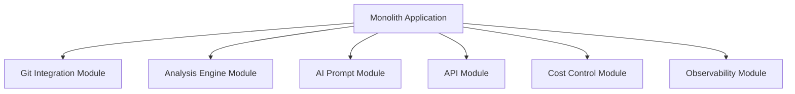
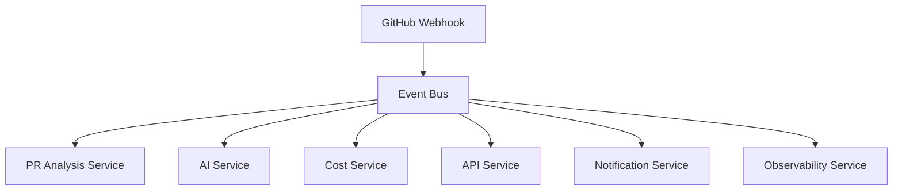
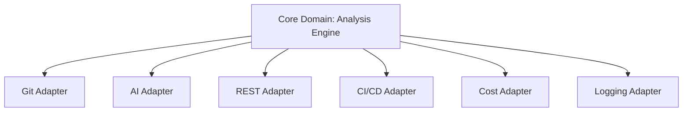
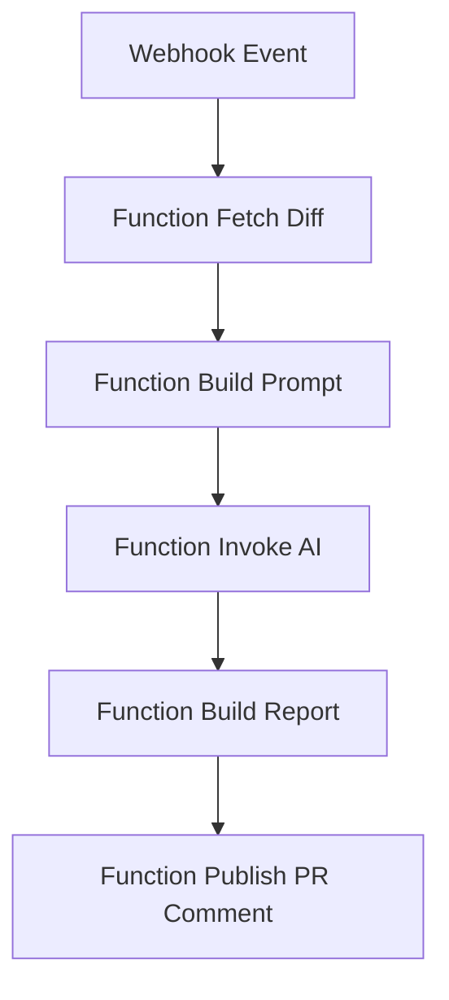
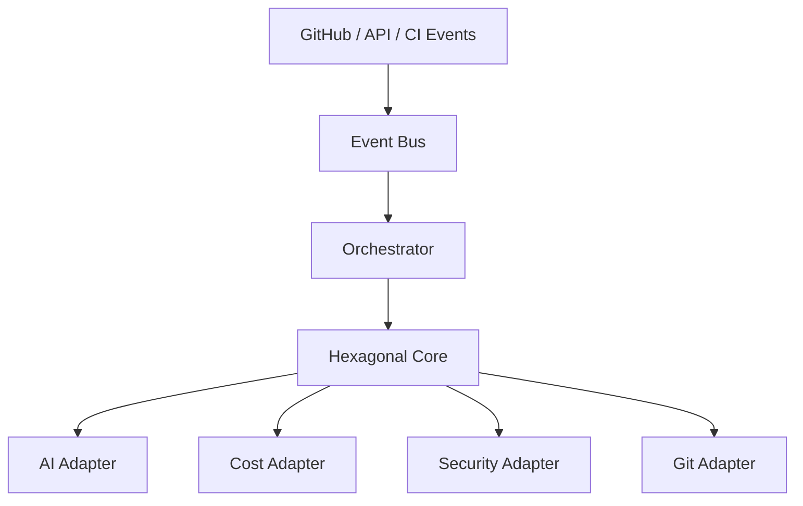

# Architecture Options

## 1. Introducción
Este documento presenta varias alternativas arquitectónicas para el sistema de revisión automática de código basado en inteligencia artificial, considerando los requisitos, dominios funcionales, flujos de negocio y nivel de complejidad definidos en DOC1–DOC4.

## 2. Arquitecturas propuestas

### ARCH-OPT-001: Monolito Modular por Dominios
- Descripción: Aplicación única desplegable organizada internamente en módulos funcionales desacoplados por dominio.
- Diagrama textual:

- Ventajas:
  - Menor complejidad inicial
  - Despliegue simple
  - Menor coste operativo inicial
- Inconvenientes:
  - Escalabilidad limitada
  - Acoplamiento creciente con el tiempo
  - Evolución más lenta
- Riesgos:
  - Saturación del proceso principal
  - Dificultad de separación futura
- Adecuación a RF:
  - Alta para MVP y primeras fases
- Adecuación a RNF:
  - Media
- Coste relativo: Bajo

### ARCH-OPT-002: Microservicios Event-Driven
- Descripción: Servicios independientes por dominio comunicados mediante eventos y mensajería asíncrona.
- Diagrama textual:

- Ventajas:
  - Alta escalabilidad
  - Desacoplamiento fuerte
  - Resiliencia elevada
- Inconvenientes:
  - Mayor complejidad operativa
  - Coste inicial elevado
  - Debugging distribuido complejo
- Riesgos:
  - Inconsistencia eventual
  - Sobrecoste de infraestructura
- Adecuación a RF:
  - Muy alta
- Adecuación a RNF:
  - Muy alta
- Coste relativo: Alto

### ARCH-OPT-003: Hexagonal (Ports & Adapters)
- Descripción: Núcleo de negocio aislado con adaptadores externos para Git, IA, API y CI/CD.
- Diagrama textual:

- Ventajas:
  - Alta mantenibilidad
  - Excelente testabilidad
  - Buen aislamiento del dominio
- Inconvenientes:
  - Mayor diseño inicial
  - Curva de aprendizaje técnica
- Riesgos:
  - Sobreingeniería en MVP pequeño
- Adecuación a RF:
  - Alta
- Adecuación a RNF:
  - Alta
- Coste relativo: Medio

### ARCH-OPT-004: Serverless Event-Driven
- Descripción: Flujo compuesto por funciones serverless independientes activadas por eventos.
- Diagrama textual:

- Ventajas:
  - Escalado automático
  - Pago por uso
  - Alta disponibilidad nativa
- Inconvenientes:
  - Dependencia del cloud provider
  - Latencia por cold starts
  - Debugging complejo
- Riesgos:
  - Costes variables impredecibles
  - Límites de ejecución runtime
- Adecuación a RF:
  - Media-Alta
- Adecuación a RNF:
  - Alta
- Coste relativo: Variable

### ARCH-OPT-005: Híbrida Hexagonal + Event-Driven
- Descripción: Núcleo hexagonal de negocio combinado con capa de integración basada en eventos.
- Diagrama textual:

- Ventajas:
  - Balance entre escalabilidad y mantenibilidad
  - Núcleo estable y extensible
  - Buen soporte multi-integración
- Inconvenientes:
  - Complejidad media-alta
  - Mayor esfuerzo de gobierno técnico
- Riesgos:
  - Integración entre patrones arquitectónicos
- Adecuación a RF:
  - Muy alta
- Adecuación a RNF:
  - Muy alta
- Coste relativo: Medio-Alto

## 3. Resumen comparativo
| Arquitectura | Complejidad | Escalabilidad | Coste | Mantenibilidad | Time to Market |
|--------------|-------------|---------------|-------|----------------|----------------|
| Monolito Modular | Baja | Media | Bajo | Media | Alto |
| Microservicios Event-Driven | Alta | Muy Alta | Alto | Alta | Medio |
| Hexagonal | Media | Alta | Medio | Muy Alta | Medio |
| Serverless Event-Driven | Media | Alta | Variable | Media | Alto |
| Híbrida Hexagonal + Event-Driven | Alta | Muy Alta | Medio-Alto | Alta | Medio |