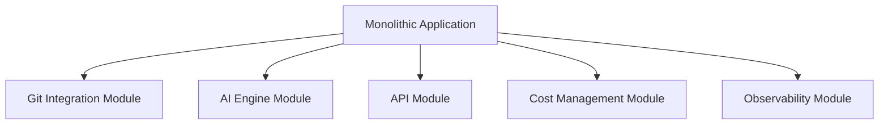

# Architecture Options

## 1. Introducción
Este documento presenta varias opciones arquitectónicas para el sistema de revisión automática de código basado en IA, derivado de DOC1–DOC4. Se consideran requisitos funcionales, no funcionales, dominios y flujos de negocio.

## 2. Arquitecturas propuestas

### ARCH-OPT-001: Monolito Modular
- Descripción: Arquitectura monolítica estructurada en módulos internos (Git, IA, API, costes, observabilidad) dentro de una única aplicación desplegable.
- Diagrama textual:

- Ventajas:
  - Simplicidad de despliegue
  - Menor complejidad inicial
  - Menor coste operativo
- Inconvenientes:
  - Escalabilidad limitada por componente
  - Acoplamiento interno elevado
  - Evolución tecnológica más lenta
- Riesgos:
  - Cuello de botella en IA y análisis
  - Difícil separación futura a microservicios
- Adecuación a RF:
  - Alta para funcionalidad básica (FR-001 a FR-013)
- Adecuación a RNF:
  - Media (escalabilidad y disponibilidad limitadas)
- Coste relativo: Bajo

---

### ARCH-OPT-002: Microservicios Event-Driven
- Descripción: Arquitectura basada en microservicios desacoplados comunicados mediante eventos (PR events, analysis events, feedback events).
- Diagrama textual:
`mermaid
flowchart TD
A[GitHub Events] --> B[Event Bus]
B --> C[PR Analyzer Service]
B --> D[AI Prompt Service]
B --> E[Cost Service]
B --> F[API Service]
B --> G[Observability Service]
C --> B
D --> B
`
- Ventajas:
  - Alta escalabilidad
  - Desacoplamiento fuerte
  - Resiliencia ante fallos
  - Evolución independiente por dominio
- Inconvenientes:
  - Alta complejidad inicial
  - Necesidad de infraestructura de eventos
  - Mayor latencia en flujos
- Riesgos:
  - Complejidad operativa elevada
  - Debugging distribuido difícil
- Adecuación a RF:
  - Muy alta (especialmente FLOW-001 y FLOW-003)
- Adecuación a RNF:
  - Muy alta (escalabilidad, trazabilidad, resiliencia)
- Coste relativo: Alto

---

### ARCH-OPT-003: Arquitectura Hexagonal (Ports & Adapters)
- Descripción: Núcleo de dominio aislado con adaptadores para Git, IA, API y CI/CD.
- Diagrama textual:
`mermaid
flowchart TD
A[Core Domain: Code Analysis Engine]
A --> B[Git Adapter]
A --> C[AI Adapter]
A --> D[API Adapter]
A --> E[CI/CD Adapter]
A --> F[Cost Adapter]
A --> G[Observability Adapter]
`
- Ventajas:
  - Alto desacoplamiento del dominio
  - Fácil testabilidad
  - Buena extensibilidad tecnológica
- Inconvenientes:
  - Diseño más complejo inicialmente
  - Requiere disciplina arquitectónica
- Riesgos:
  - Overengineering si el sistema crece lentamente
- Adecuación a RF:
  - Alta (especialmente motor de análisis FR-001, FR-012)
- Adecuación a RNF:
  - Alta (mantenibilidad y extensibilidad)
- Coste relativo: Medio

---

### ARCH-OPT-004: Serverless Event-Driven (Cloud Native)
- Descripción: Uso de funciones serverless para cada paso del flujo de análisis.
- Diagrama textual:
`mermaid
flowchart TD
A[GitHub Event] --> B[Function: Fetch Diff]
B --> C[Function: Build Prompt]
C --> D[Function: Call AI]
D --> E[Function: Store Result]
E --> F[Function: Post Comment]
`
- Ventajas:
  - Escalabilidad automática
  - Pago por uso
  - Alta resiliencia
- Inconvenientes:
  - Debugging complejo
  - Dependencia de vendor cloud
  - Latencia entre funciones
- Riesgos:
  - Cold starts
  - Control limitado de ejecución
- Adecuación a RF:
  - Media-Alta
- Adecuación a RNF:
  - Alta (escalabilidad, disponibilidad)
- Coste relativo: Variable (bajo a medio según uso)

## 3. Resumen comparativo
| Arquitectura | Complejidad | Escalabilidad | Coste | Mantenibilidad | Adecuación global |
|--------------|-------------|---------------|-------|----------------|--------------------|
| Monolito Modular | Baja | Media | Bajo | Media | Media |
| Microservicios Event-Driven | Alta | Muy Alta | Alto | Alta | Muy Alta |
| Hexagonal | Media-Alta | Alta | Medio | Muy Alta | Alta |
| Serverless Event-Driven | Media | Alta | Variable | Media | Alta |
