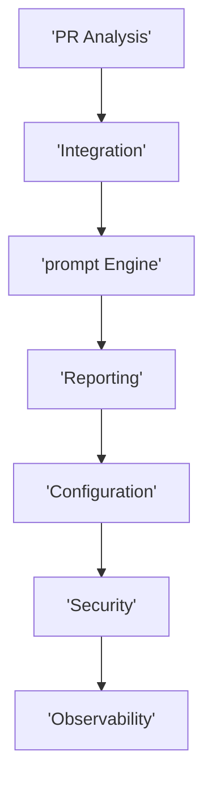

# Functional Domain Map
## Domains
### DOMAIN001 PR Analysis
Handles diff ingestion prompt creation AI invocation and result interpretation
### DOMAIN002 Integration
GitHub and CI CD event handling webhook processing
### DOMAIN003 Prompt Engine
Template management versioning and dynamic prompt assembly
### DOMAIN004 Reporting
PR comments structured reports and API responses
### DOMAIN005 Configuration
Repository level settings cost limits feature flags
### DOMAIN006 Security
Auth encryption OWASP detection and secure processing
### DOMAIN007 Observability
Logging metrics tracing and audit trails
## Domain map
