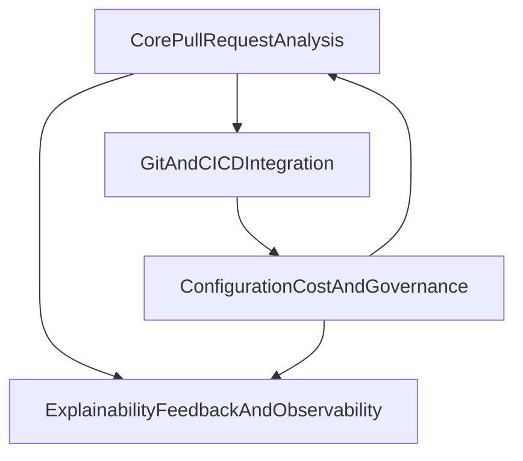

# Functional Domain Map
## 1. Introducción
Este documento agrupa los requisitos en dominios funcionales para facilitar el diseño, el sizing y el backlog.

## 2. Bloques funcionales
### DOMAIN-001 CorePullRequestAnalysis
- Descripción: Núcleo de análisis automático de Pull Requests y generación de informes.
- Requisitos asociados: FR-001, FR-002, FR-006, FR-007, FR-008, FR-015; NFR-001, NFR-002, NFR-004, NFR-005, NFR-010.
- Complejidad: Alta (uso de IA, rendimiento, seguridad).
- Dependencias: AI Service Provider, Git Provider, CI CD System.

### DOMAIN-002 GitAndCICDIntegration
- Descripción: Integración con proveedores Git y sistemas CI/CD.
- Requisitos asociados: FR-003, FR-004, FR-010; NFR-003, NFR-011.
- Complejidad: Media.
- Dependencias: GitHub, GitHub Actions u otros CI/CD.

### DOMAIN-003 ConfigurationCostAndGovernance
- Descripción: Configuración por repositorio, control de costes, políticas y activación.
- Requisitos asociados: FR-009, FR-011, FR-014; NFR-009.
- Complejidad: Media.
- Dependencias: Organization Admin, Repository Administrator, sistemas de facturación.

### DOMAIN-004 ExplainabilityFeedbackAndObservability
- Descripción: Explicabilidad, feedback de calidad, observabilidad y trazabilidad.
- Requisitos asociados: FR-012, FR-013, FR-005; NFR-006, NFR-007, NFR-008, NFR-010.
- Complejidad: Media.
- Dependencias: AI Service Provider, sistemas de logging y métricas.

## 3. Mapa general de dominios

