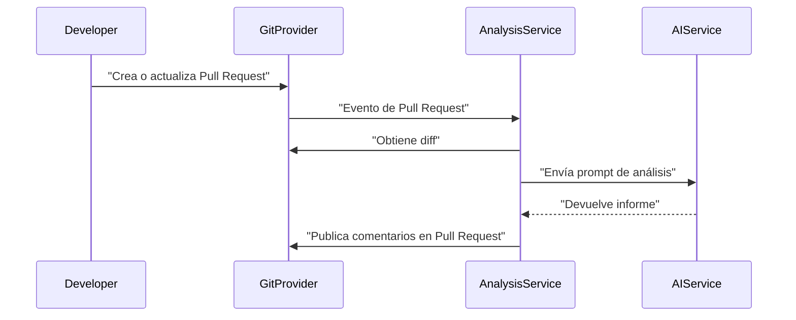

# Business Flows
## 1. Introducción
Este documento detalla los flujos de negocio clave asociados a la plataforma, alineados con los requisitos funcionales y dominios.

## 2. Flujos
### FLOW-001 Análisis automático de Pull Request
- Actor principal: Developer, Git Provider, CI CD System.
- Objetivo: Analizar automáticamente los cambios de un Pull Request y publicar resultados.
- Flujo principal:
  1. Se crea o actualiza un Pull Request.
  2. El proveedor Git envía un evento al sistema.
  3. El sistema obtiene el diff del PR.
  4. Se construye el prompt para la IA.
  5. Se invoca el servicio de IA.
  6. Se genera el informe de análisis.
  7. Se publica un comentario en el Pull Request.
- Alternativas:
  - PR demasiado grande: se genera aviso y se limita el análisis.
  - Error de IA: se registra error y se notifica al usuario.
- Eventos clave: recepción de evento de PR, llamada a IA, publicación de comentarios.

### FLOW-002 Análisis vía API REST
- Actor principal: Cliente externo.
- Objetivo: Permitir análisis bajo demanda mediante API REST.
- Flujo principal:
  1. El cliente envía una petición a la API REST con código o diff.
  2. El sistema valida la API key.
  3. Se construye el prompt.
  4. Se invoca la IA.
  5. Se devuelve el informe al cliente.
- Alternativas: API key inválida, límites de coste superados.
- Eventos clave: validación de API key, llamada a IA, respuesta HTTP.

### FLOW-003 Feedback de calidad
- Actor principal: Developer.
- Objetivo: Recoger feedback sobre la utilidad de los resultados.
- Flujo principal:
  1. El usuario revisa los resultados del análisis.
  2. Marca issues o feedback (útil/no útil, falso positivo, etc.).
  3. El sistema almacena el feedback asociado al análisis.
  4. El feedback se usa para mejorar prompts y reglas futuras.
- Alternativas: feedback anónimo, feedback desactivado.
- Eventos clave: envío de feedback, actualización de configuración de prompts.

### FLOW-004 Control de costes y activación
- Actor principal: Repository Administrator, Organization Admin.
- Objetivo: Controlar la ejecución de análisis según límites de coste y políticas.
- Flujo principal:
  1. El administrador configura límites de uso y políticas por repositorio u organización.
  2. El sistema valida permisos y límites antes de cada análisis.
  3. Si se cumplen las condiciones, se ejecuta el análisis.
  4. Si se superan límites, se bloquea el análisis y se notifica.
- Alternativas: modo trial, modo solo resumen.
- Eventos clave: actualización de límites, bloqueo de análisis por coste.
