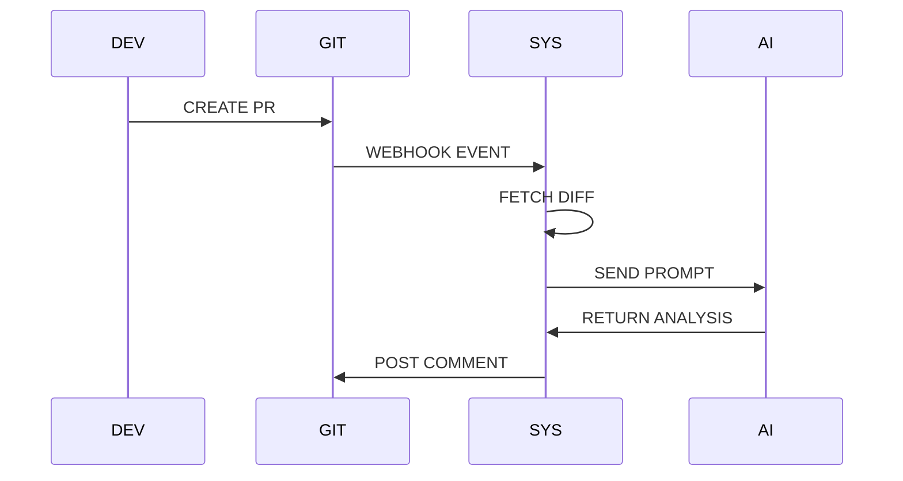
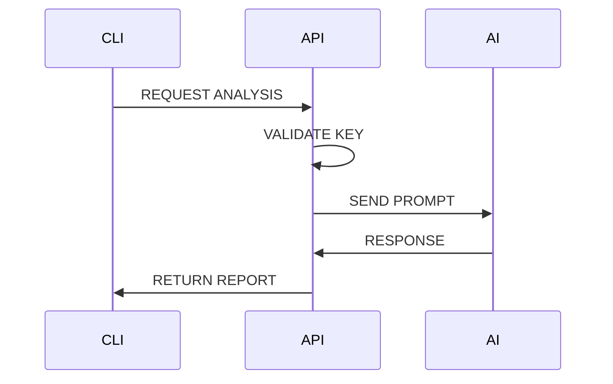
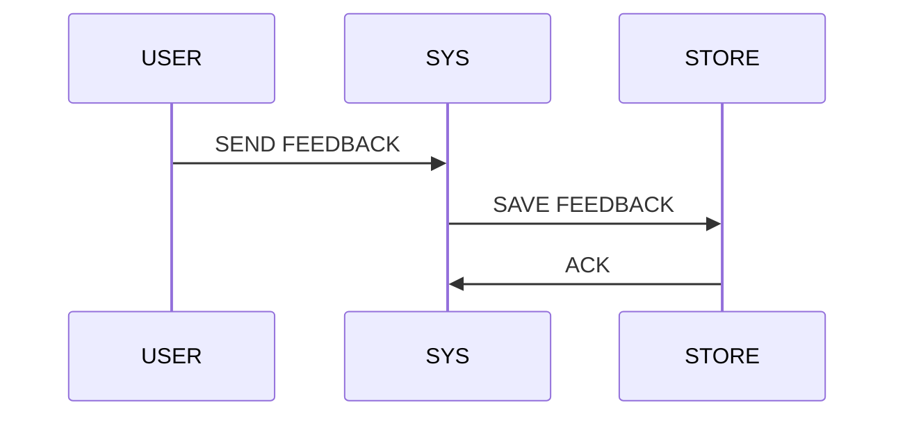
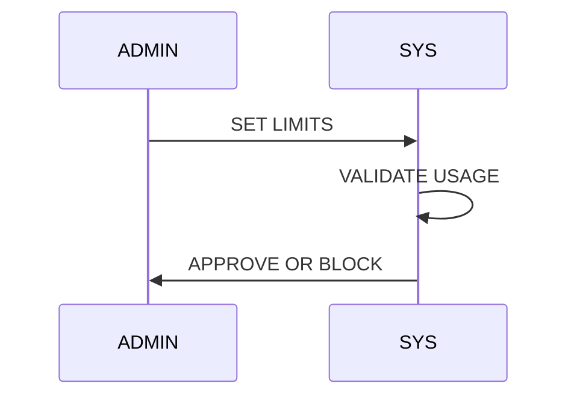

# Business Flows
## FLOW001 PR Analysis Flow
Actor Developer System Git AI
Objective Analyze pull request

```mermaid
sequenceDiagram
participant DEV
participant GIT
participant SYS
participant AI
DEV->>GIT: CREATE PR
GIT->>SYS: WEBHOOK EVENT
SYS->>SYS: FETCH DIFF
SYS->>AI: SEND PROMPT
AI->>SYS: RETURN ANALYSIS
SYS->>GIT: POST COMMENT
```
## FLOW002 REST API Analysis

```mermaid
sequenceDiagram
participant CLI
participant API
participant AI
CLI->>API: REQUEST ANALYSIS
API->>API: VALIDATE KEY
API->>AI: SEND PROMPT
AI->>API: RESPONSE
API->>CLI: RETURN REPORT
```
## FLOW003 Feedback Loop

```mermaid
sequenceDiagram
participant USER
participant SYS
participant STORE
USER->>SYS: SEND FEEDBACK
SYS->>STORE: SAVE FEEDBACK
STORE->>SYS: ACK
```
## FLOW004 Cost Control

```mermaid
sequenceDiagram
participant ADMIN
participant SYS
ADMIN->>SYS: SET LIMITS
SYS->>SYS: VALIDATE USAGE
SYS->>ADMIN: APPROVE OR BLOCK
```