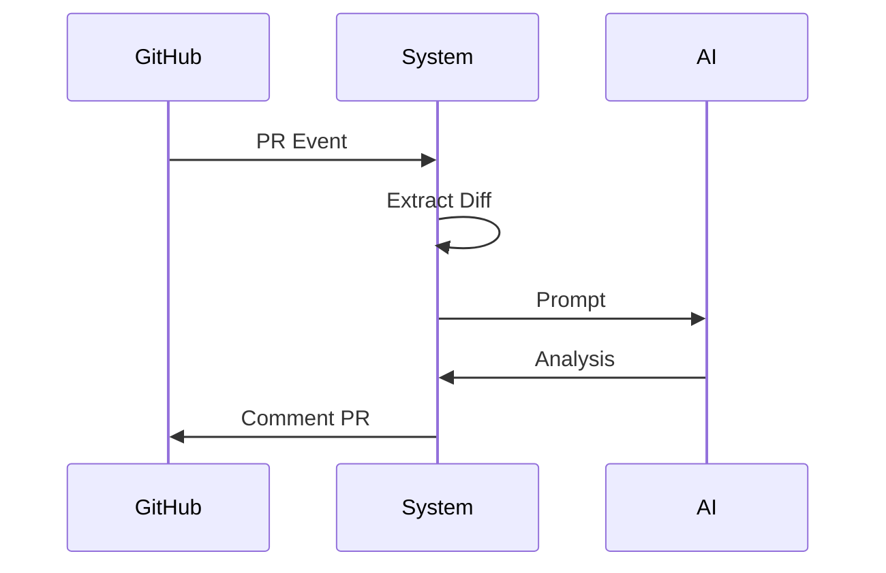

# Business Flows

## FLOW-001 Análisis automático de Pull Request
- Actor principal: Developer / GitHub
- Objetivo: Analizar PR automáticamente

### Flujo principal
1 Evento PR creado
2 GitHub webhook
3 Extracción diff
4 Construcción prompt
5 Invocación IA
6 Generación reporte
7 Comentario en PR

### Alternativas
- Error API IA -> retry
- PR demasiado grande -> rechazo

### Eventos clave
- PullRequestOpened
- AnalysisCompleted

## FLOW-002 API REST Analysis
- Cliente envía request
- Validación API key
- IA processing
- Response JSON

## FLOW-003 Feedback loop
- Usuario envía feedback
- Sistema almacena feedback
- Mejora prompts

## FLOW-004 Control de costes
- Validación límites
- Bloqueo si excede