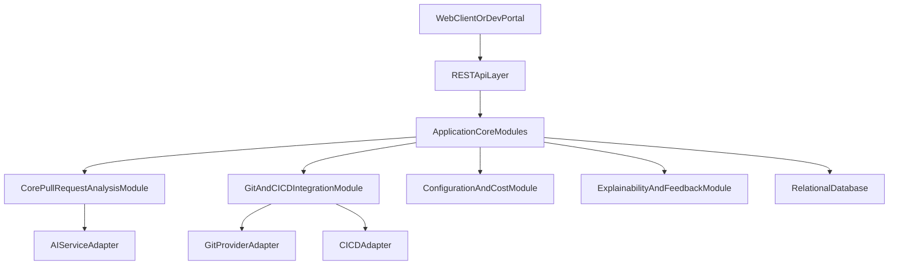

# Architecture Options
## 1. Evaluación previa de necesidad arquitectónica
- Tamaño del proyecto: MEDIUM (ver DOC4).
- Complejidad funcional: Moderada, con un flujo principal dominante (análisis de PR) y algunos flujos complementarios.
- RNF relevantes: rendimiento < 60 segundos, seguridad y privacidad, control de costes, observabilidad, escalabilidad razonable.
- Riesgos de sobredimensionamiento: uso innecesario de microservicios, Kubernetes o arquitecturas event-driven para un alcance inicial acotado.

## 2. Arquitecturas propuestas
### ARCH-OPT-001 Monolito modular 3-tier con Clean Architecture
- Nivel de complejidad: Medio.
- Justificación basada en requisitos:
  - Permite implementar dominios CorePullRequestAnalysis, GitAndCICDIntegration, ConfigurationCostAndGovernance y ExplainabilityFeedbackAndObservability como módulos internos.
  - Satisface NFR-006 Mantenibilidad modular y NFR-007 Extensibilidad mediante capas y puertos/adaptadores.
  - Encaja con NFR-002 Rendimiento y NFR-003 Alta disponibilidad sin necesidad de microservicios.
- Diagrama visual:

- Explicación del diagrama:
  - Una capa de API REST expone endpoints para análisis de PR y análisis directos.
  - El núcleo de aplicación se organiza en módulos por dominio funcional.
  - Adaptadores externos gestionan integración con Git, CI/CD y proveedor de IA.
  - Una base de datos relacional almacena configuraciones, resultados de análisis y feedback (sin persistir código completo por defecto).
- Ventajas:
  - Simplicidad operativa y despliegue único.
  - Buena alineación con Clean Architecture y mantenibilidad.
  - Facilita el control de costes y la observabilidad centralizada.
- Inconvenientes:
  - Escalado horizontal a nivel de proceso completo, no por dominio.
  - Menor aislamiento de fallos entre dominios.
- Riesgos:
  - Si la extensibilidad tecnológica crece muy rápido, el monolito puede volverse pesado.
- Coste relativo: Medio (infraestructura simple, desarrollo moderado).
- Adecuación al tamaño del proyecto: Alta para un proyecto MEDIUM.

## 3. Pila tecnológica recomendada
- Backend: Java Spring Boot (alineado con FR-006 y ecosistema CI/CD).
- Frontend: React (para un portal ligero de administración y visualización de resultados).
- Base de datos: PostgreSQL (relacional, robusta, coste razonable).
- Infraestructura: Contenedor Docker desplegado en VM o plataforma de contenedores simple (sin Kubernetes obligatorio).
- Integración: Webhooks de GitHub, GitHub Actions, API REST.
- Observabilidad: Prometheus y Grafana o solución equivalente, logs estructurados.
- Seguridad: HTTPS, API keys, integración futura con OAuth2 si se requiere.
- Justificación:
  - Cumple las guardrails de proyecto MEDIUM evitando Kubernetes, Kafka o NoSQL avanzado.
  - Spring Boot facilita integración con GitHub, CI/CD y proveedores de IA.
- Alternativa más simple:
  - Backend Spring Boot sin frontend dedicado, usando solo comentarios en PR y una consola mínima.

## 4. Recomendación basada en simplicidad
Se recomienda adoptar ARCH-OPT-001 (monolito modular 3-tier con Clean Architecture) con la pila tecnológica propuesta, evitando microservicios y orquestadores complejos hasta que el volumen de uso y la diversidad tecnológica justifiquen una evolución arquitectónica.
