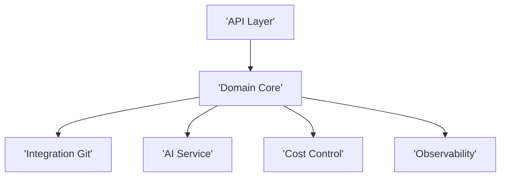

# Architecture Options
## Evaluation
Medium size system with external AI dependency favors modular monolith
## ARCHOPT001 Modular Monolith Clean Architecture
### Diagram

### Explanation
Single deployable with internal modules
### Advantages
Lower complexity faster delivery lower cost
### Disadvantages
Scaling limits under extreme load
### Risks
Tight coupling if not well modularized
### Cost
Low to medium
## Tech stack
Backend Spring Boot or NodeJS
Frontend React optional dashboard
DB PostgreSQL
Infra Docker VM
API REST
Observability logs metrics
Security API keys HTTPS
## Alternative
Microservices overkill for current scope
## Recommendation
Modular monolith preferred