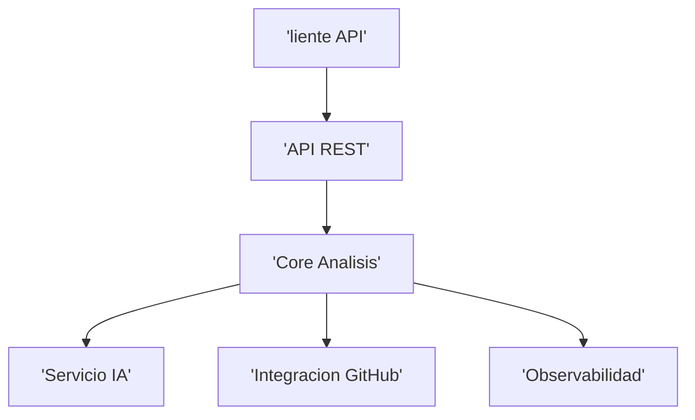

# Architecture Options

## 1. Evaluación previa
- Tamaño: Medium
- Complejidad: Media-Alta (IA + Git integration)
- RNF: seguridad, escalabilidad, observabilidad
- Riesgo de sobrearquitectura: Alto si se usa microservicios

## 2. Arquitecturas propuestas

### ARCH-OPT-001 Monolito Modular Hexagonal
- Complejidad: Media
- Justificación: reduce overhead, facilita control costes IA

- Ventajas: simple, coste bajo, fácil mantenimiento
- Inconvenientes: escalado granular limitado
- Riesgos: crecimiento futuro puede requerir refactor
- Coste relativo: Bajo-Medio
- Adecuación: Alta

## 3. Pila tecnológica recomendada
- Backend: Java Spring Boot
- Frontend: React
- DB: PostgreSQL
- Infra: Docker
- API: REST
- Observabilidad: logs estructurados
- Seguridad: OAuth/API Keys

Justificación: ecosistema maduro y estable

Alternativa más simple: Node.js + Express + PostgreSQL

## 4. Recomendación
Monolito modular con arquitectura hexagonal