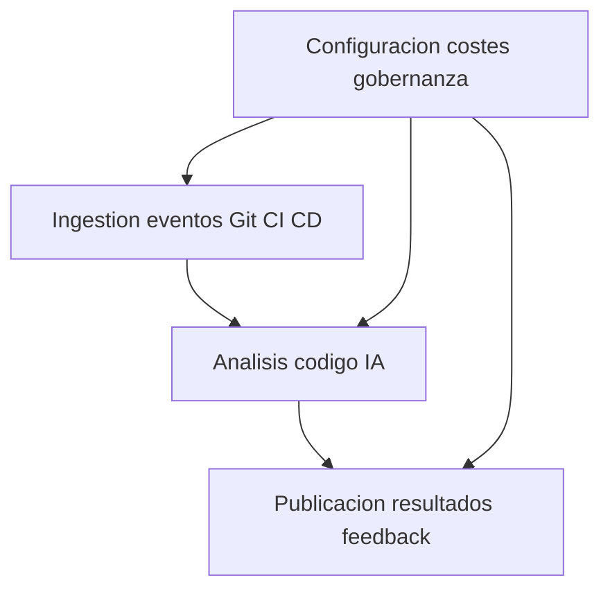

# Functional Domain Map
## 1. Introduccion
Se identifican varios dominios funcionales principales para estructurar la plataforma de analisis de codigo con IA y su integracion con Git y CI CD.

## 2. Bloques funcionales
### DOMAIN 001 Ingestion de eventos Git y CI CD
- Descripcion
  - Gestion de eventos de Pull Requests y ejecuciones de CI CD desde GitHub y otros proveedores.
- Requisitos asociados
  - FR 001 FR 003 FR 004 NFR 011.
- Complejidad
  - Media por necesidad de integrar webhooks autenticacion y distintos proveedores.
- Dependencias
  - Git Provider CI CD System configuracion por repositorio.

### DOMAIN 002 Analisis de codigo con IA
- Descripcion
  - Construccion de prompts obtencion de diffs invocacion a servicios de IA y generacion de resultados.
- Requisitos asociados
  - FR 001 FR 002 FR 005 FR 006 FR 007 FR 012 FR 013 FR 015 NFR 001 NFR 002 NFR 004 NFR 005 NFR 006 NFR 007.
- Complejidad
  - Alta por dependencia de IA rendimiento y seguridad.
- Dependencias
  - AI Service Provider configuracion de prompts control de costes.

### DOMAIN 003 Publicacion de resultados y feedback
- Descripcion
  - Publicacion de comentarios en Pull Requests gestion de feedback de calidad y explicabilidad.
- Requisitos asociados
  - FR 002 FR 008 FR 012 FR 013 NFR 008 NFR 010.
- Complejidad
  - Media por necesidad de buen diseño de experiencia de desarrollador.
- Dependencias
  - Git Provider almacenamiento de resultados observabilidad.

### DOMAIN 004 Configuracion costes y gobernanza
- Descripcion
  - Gestion de configuracion por repositorio limites de costes autenticacion y politicas de uso.
- Requisitos asociados
  - FR 009 FR 010 FR 011 FR 014 NFR 004 NFR 005 NFR 008 NFR 009 NFR 010 NFR 011.
- Complejidad
  - Media por impacto en seguridad y gobernanza.
- Dependencias
  - Organization Admin Repository Administrator AI Service Provider.

## 3. Mapa general de dominios

