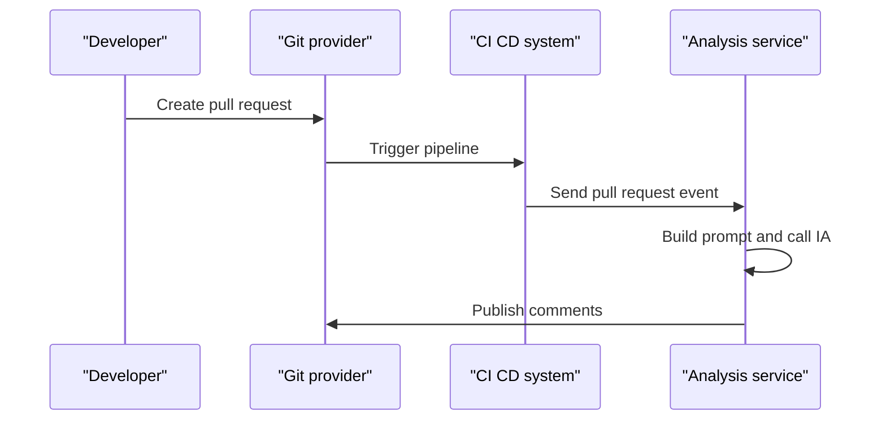
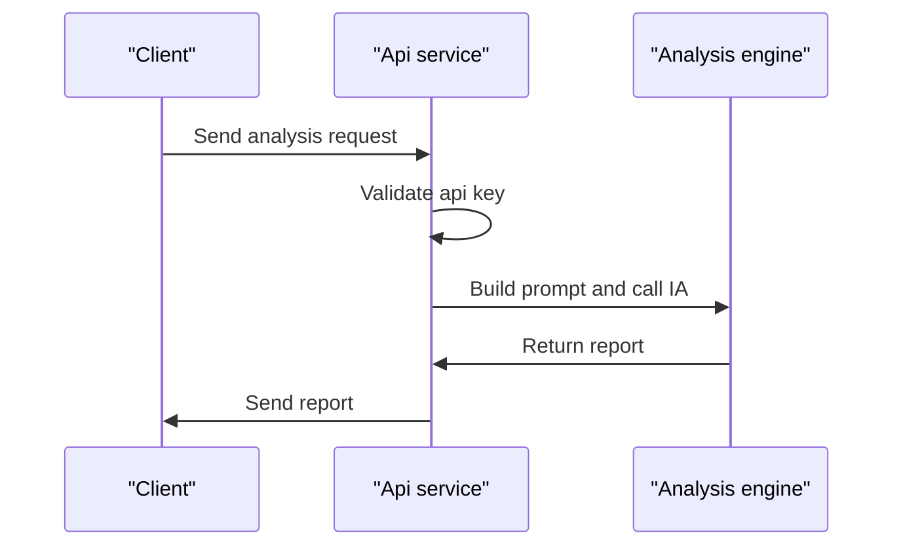
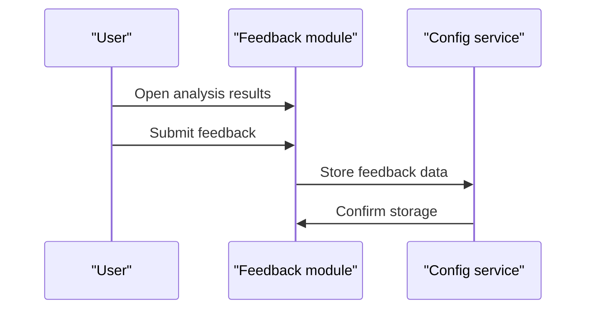
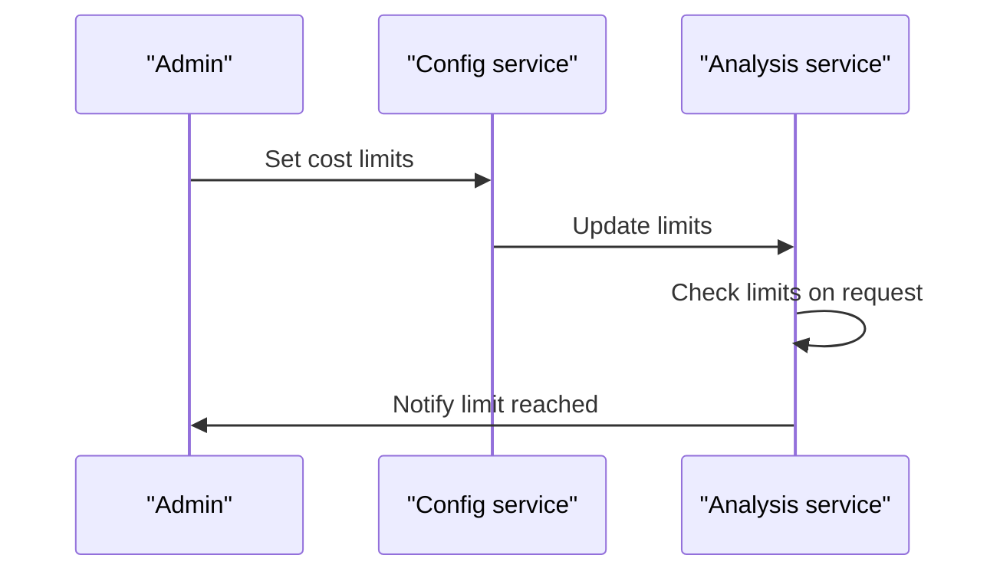

# Business Flows
## 1. Introduccion
Se describen los flujos de negocio clave que articulan el funcionamiento de la plataforma desde la creacion de Pull Requests hasta el control de costes y el feedback de calidad.

## 2. Flujos
### FLOW 001 Analisis automatico de Pull Request
- Actor principal
  - Developer Git Provider CI CD System.
- Objetivo
  - Analizar automaticamente los cambios de un Pull Request y publicar comentarios de calidad y seguridad.
- Flujo principal
  1 Se crea o actualiza Pull Request.
  2 Git provider envia evento.
  3 Se obtiene diff del cambio.
  4 Se construye prompt de analisis.
  5 Se invoca IA.
  6 Se genera informe.
  7 Se publica comentario en Pull Request.
- Alternativas
  - Fallo en proveedor de IA.
  - Superacion de limites de coste.
- Eventos clave
  - Recepcion de evento de Pull Request.
  - Finalizacion de analisis y publicacion de comentarios.

### FLOW 002 Analisis via API REST
- Actor principal
  - Cliente externo.
- Objetivo
  - Permitir analisis bajo demanda mediante API REST.
- Flujo principal
  1 Cliente envia request.
  2 Validacion de API key.
  3 Construccion de prompt.
  4 Invocacion de IA.
  5 Retorno de informe.
- Alternativas
  - API key invalida.
  - Error de proveedor de IA.
- Eventos clave
  - Recepcion de peticion API.
  - Devolucion de informe.

### FLOW 003 Feedback de calidad
- Actor principal
  - Developer Repository Administrator.
- Objetivo
  - Recoger feedback sobre la utilidad de los resultados y mejorar los prompts.
- Flujo principal
  1 Usuario revisa resultados.
  2 Marca issues o feedback.
  3 Se almacena feedback.
  4 Mejora de prompts futura.
- Alternativas
  - Falta de uso del feedback.
- Eventos clave
  - Registro de feedback.

### FLOW 004 Control de costes y activacion
- Actor principal
  - Organization Admin Repository Administrator.
- Objetivo
  - Configurar limites de uso y decidir cuando ejecutar o bloquear analisis.
- Flujo principal
  1 Admin configura limites.
  2 Sistema valida permisos.
  3 Ejecuta o bloquea analisis.
- Alternativas
  - Limites superados.
- Eventos clave
  - Actualizacion de configuracion de costes.
  - Bloqueo de analisis por limite.

