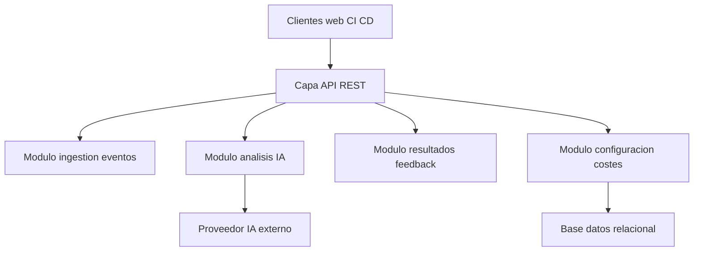
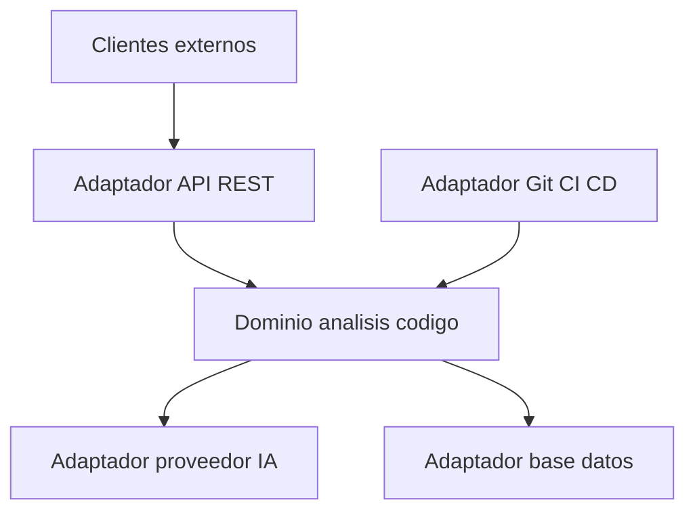

# Architecture Options
## 1. Evaluacion previa de necesidad arquitectonica
- Tamaño del proyecto
  - MEDIUM con varios dominios pero alcance inicial acotado.
- Complejidad funcional
  - Integracion con Git CI CD IA configuracion y feedback.
- RNF relevantes
  - Escalabilidad rendimiento menor a 60 segundos alta disponibilidad seguridad privacidad observabilidad control de costes.
- Riesgos de sobredimensionamiento
  - Introducir microservicios o arquitecturas distribuidas complejas seria excesivo para el alcance actual.

## 2. Arquitecturas propuestas
### ARCH OPT 001 Monolito modular tres capas con API REST
- Nivel de complejidad
  - Medio bajo.
- Justificacion basada en requisitos
  - Permite implementar dominios de ingestion analisis publicacion y configuracion en modulos internos bien separados.
  - Facilita exponer API REST para analisis y gestion de configuracion.
  - Encaja con NFR de mantenibilidad modular extensibilidad y observabilidad.
- Diagrama visual

- Explicacion del diagrama
  - Los clientes CI CD y otros servicios consumen la capa API REST.
  - La logica se organiza en modulos internos por dominio funcional.
  - La configuracion y trazabilidad se almacenan en una base de datos relacional.
  - El modulo de analisis se integra con el proveedor de IA externo.
- Ventajas
  - Simplicidad de despliegue y operacion.
  - Facil de evolucionar hacia mas lenguajes dentro del mismo monolito modular.
  - Menor coste de infraestructura.
- Inconvenientes
  - Escalado por modulo menos granular que en microservicios.
  - Requiere disciplina interna para mantener modularidad.
- Riesgos
  - Riesgo de convertir el monolito en un sistema poco modular si no se aplican buenas practicas.
- Coste relativo
  - Bajo medio.
- Adecuacion al tamaño del proyecto
  - Muy adecuada para proyecto MEDIUM.

### ARCH OPT 002 Monolito modular con arquitectura hexagonal
- Nivel de complejidad
  - Medio.
- Justificacion basada en requisitos
  - Permite separar claramente dominio de analisis de codigo de adaptadores a Git CI CD IA y base de datos.
  - Facilita extensibilidad tecnologica y pruebas.
- Diagrama visual

- Explicacion del diagrama
  - El nucleo de dominio contiene reglas de analisis y gestion de configuracion.
  - Los adaptadores conectan con Git CI CD IA y almacenamiento.
- Ventajas
  - Alta mantenibilidad y testabilidad.
  - Facil de extender a nuevos proveedores y lenguajes.
- Inconvenientes
  - Mayor esfuerzo inicial de diseño.
- Riesgos
  - Sobredimensionamiento si el equipo no esta familiarizado con el estilo hexagonal.
- Coste relativo
  - Medio.
- Adecuacion al tamaño del proyecto
  - Adecuada pero solo si el equipo tiene experiencia.

## 3. Pila tecnologica recomendada
- Backend
  - Java Spring Boot para alinearse con el foco inicial y ecosistema maduro.
- Frontend
  - Panel de administracion ligero con React o sin frontend dedicado en una primera fase usando solo integracion con Git y CI CD.
- Base de datos
  - PostgreSQL para configuracion limites de costes y trazabilidad de analisis.
- Infraestructura
  - Despliegue en contenedor Docker simple o maquinas virtuales sin Kubernetes.
- Integracion
  - Webhooks y APIs de GitHub y otros proveedores Git.
- Observabilidad
  - Logs estructurados metricas basicas y trazas mediante herramientas como Prometheus y Grafana o servicios gestionados equivalentes.
- Seguridad
  - HTTPS obligatorio gestion de API keys y cifrado en reposo para datos sensibles.
- Justificacion
  - El stack propuesto es estandar soporta los requisitos no funcionales y evita complejidad innecesaria.
- Alternativa mas simple
  - Un unico servicio Spring Boot con almacenamiento en base de datos gestionada y sin panel de administracion inicial solo configuracion via ficheros y variables de entorno.

## 4. Recomendacion basada en simplicidad
- Recomendacion principal
  - ARCH OPT 001 Monolito modular tres capas con API REST usando Java Spring Boot y PostgreSQL desplegado en Docker.
- Motivos
  - Equilibrio entre simplicidad y capacidad de crecimiento.
  - Alineado con el tamano MEDIUM y los requisitos de seguridad y observabilidad.
