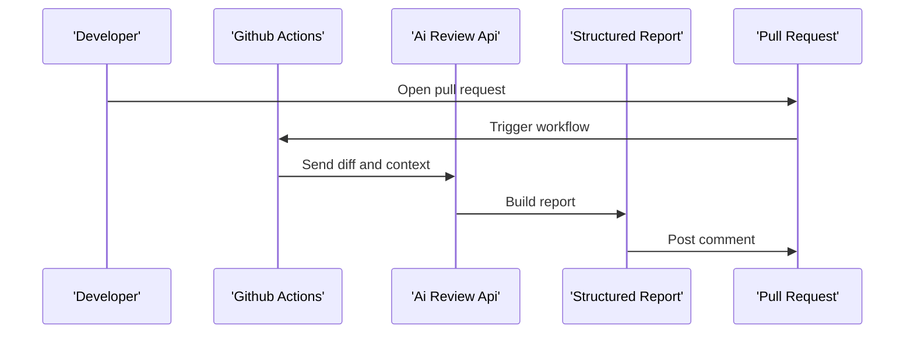
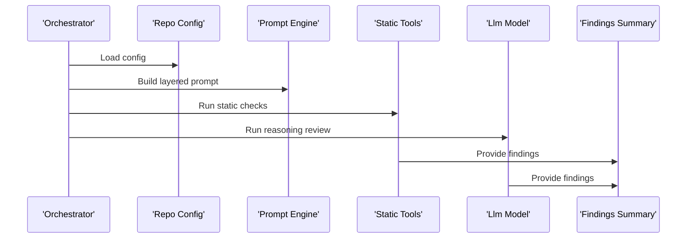
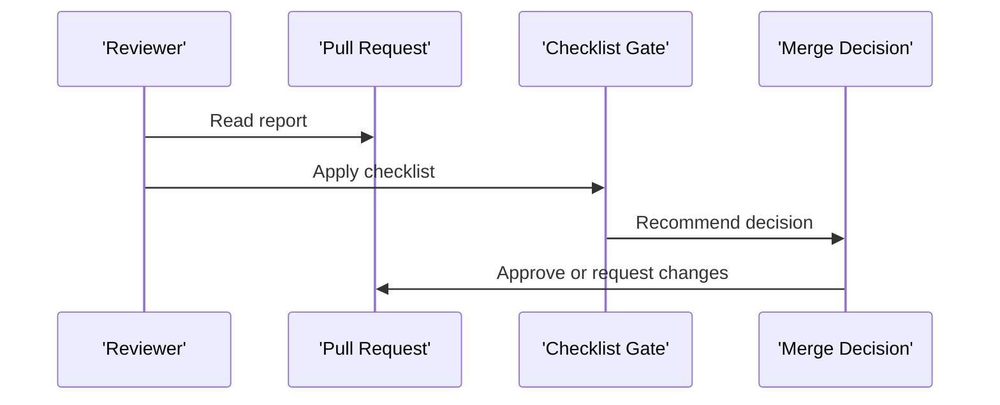

# Business Flows

## 1. Introducción
Los flujos describen el comportamiento desde la apertura o actualizacion de una PR hasta la publicacion del informe y la validacion por checklist.

## 2. Flujos
### FLOW-001
- Actor principal: Developer
- Objetivo: Lanzar revision automatica al abrir o actualizar una PR
- Flujo principal
 1. Developer crea o actualiza Pull Request
 2. GitHub Actions detecta el evento
 3. Se obtiene diff y lista de archivos
 4. Se llama al servicio de analisis
 5. Se genera reporte estructurado
 6. Se publica comentario en la PR
- Alternativas
 - Si el diff supera limite se analiza por lotes y se resume
 - Si falla el proveedor LLM se publica fallo controlado y se sugiere reintento
- Eventos clave: Pull Request opened Pull Request synchronize

### FLOW-002
- Actor principal: System
- Objetivo: Construir prompts por capas y ejecutar analisis hibrido
- Flujo principal
 1. Se cargan reglas corporativas base
 2. Se aplican reglas por tecnologia Java Spring Boot y React
 3. Se aplica perfil por tipo de proyecto
 4. Se añade contexto de diff y configuracion del repositorio
 5. Se ejecutan herramientas deterministas y luego analisis LLM
 6. Se consolidan hallazgos con severidad
- Alternativas
 - Si faltan reglas por tecnologia se usa solo prompt base
- Eventos clave: Prompt build Analysis run

### FLOW-003
- Actor principal: Reviewer
- Objetivo: Validar checklist y decidir aprobacion
- Flujo principal
 1. Reviewer revisa comentario con reporte
 2. Aplica checklist de calidad seguridad estandares documentacion
 3. Decide aprobar o pedir cambios
- Alternativas
 - Si el reporte indica severidad alta se recomienda cambios obligatorios
- Eventos clave: Review gate Decision

