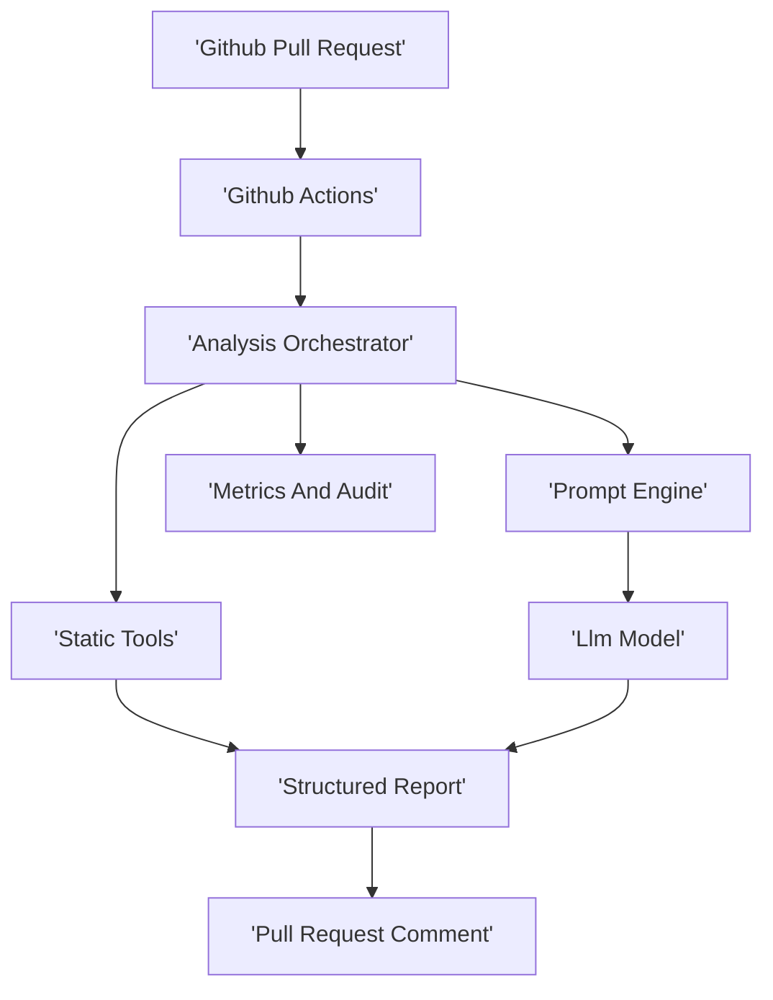
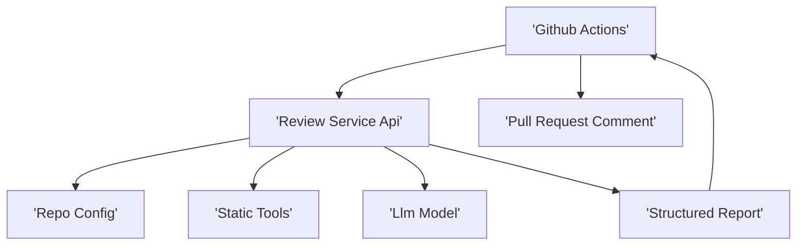

# Architecture Options

## 1. Evaluación previa de necesidad arquitectónica
- Tamaño del proyecto: MEDIUM
- Complejidad funcional: Orquestacion de PR prompts analisis hibrido reporte y configuracion
- RNF relevantes: Privacidad seguridad latencia auditabilidad
- Riesgos de sobredimensionamiento: Introducir microservicios o orquestacion compleja sin necesidad

## 2. Arquitecturas propuestas
### ARCH-OPT-001
- Nivel de complejidad: Bajo a Medio
- Justificación basada en requisitos: Encaja con MEDIUM minimiza operacion facilita despliegue y gobierno. Permite modularidad interna por dominios y extensiones de reglas.
- Diagrama visual:

- Explicación del diagrama
 - GitHub Actions actua como disparador y ejecutor de pipeline
 - El orquestador prepara contexto y llama a herramientas deterministas y al LLM
 - Se consolida un reporte y se comenta en la PR
- Ventajas
 - Simplicidad operativa
 - Despliegue unico y facil versionado
 - Facil auditoria y trazabilidad
- Inconvenientes
 - Escalado horizontal limitado por proceso si crece el volumen
 - Riesgo de tiempos altos si se analiza demasiada informacion por PR
- Riesgos
 - Dependencia de proveedor LLM
 - Manejo de secretos y datos sensibles
- Coste relativo: Bajo
- Adecuación al tamaño del proyecto: Alta
- Riesgos de sobredimensionamiento: Bajos
- Alternativa más simple: Solo herramientas deterministas y checklist sin LLM

### ARCH-OPT-002
- Nivel de complejidad: Medio
- Justificación basada en requisitos: Aislar el analisis en un servicio dedicado mejora control de secretos y escalado. Sigue siendo simple si es un unico servicio.
- Diagrama visual:

- Explicación del diagrama
 - GitHub Actions solo orquesta y delega el analisis
 - Un servicio API central gestiona prompts reglas y ejecucion
- Ventajas
 - Mejor centralizacion multi repo
 - Mejor control de configuracion y auditoria
- Inconvenientes
 - Requiere despliegue y operacion de un servicio
 - Gestion de disponibilidad y escalado
- Riesgos
 - Incremento de superficie de seguridad del servicio
- Coste relativo: Medio
- Adecuación al tamaño del proyecto: Alta
- Riesgos de sobredimensionamiento: Medios
- Alternativa más simple: Ejecutar todo dentro de GitHub Actions sin servicio

## 3. Pila tecnológica recomendada
- Backend: Java Spring Boot para el servicio central o Node js para un servicio ligero si solo orquesta
- Frontend: No requerido para MVP. Opcional panel simple mas adelante
- Base de datos: PostgreSQL opcional si se requiere historico auditoria y configuracion por repo
- Infraestructura: Docker simple en VM o plataforma gestionada
- Integración: GitHub Actions GitHub API
- Observabilidad: Logs estructurados metricas basicas
- Seguridad: Gestion de secretos en GitHub Secrets redaccion de datos y politicas
- Justificación: Stack estandar y simple para MEDIUM con baja carga operativa
- Alternativa más simple: Sin base de datos y sin servicio dedicado solo GitHub Actions

## 4. Recomendación basada en simplicidad
Recomendada ARCH-OPT-001 para MVP. Evolucionar a ARCH-OPT-002 cuando el numero de repos o el volumen de PR lo justifique.
