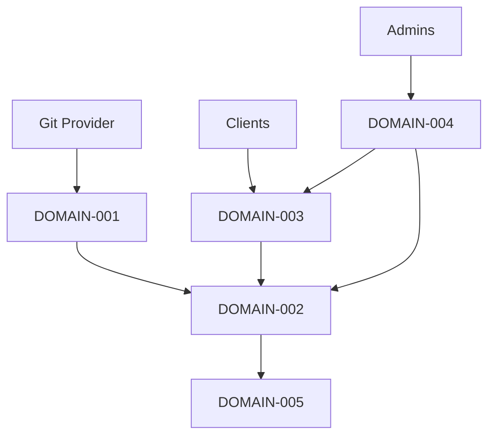

# Functional Domain Map

## 1. Introducción
Descomposición funcional para diseño modular y planificación incremental.

## 2. Bloques funcionales
### DOMAIN-001: Integración Git
- Descripción: Webhooks, diffs, comentarios PR
- Requisitos asociados (FR/NFR): FR-001 FR-003 FR-008 NFR-011
- Complejidad: Media
- Dependencias: GitHub API
### DOMAIN-002: Motor de Análisis IA
- Descripción: Prompting, orquestación y scoring
- Requisitos asociados (FR/NFR): FR-002 FR-005 FR-012 FR-015 NFR-002
- Complejidad: Alta
- Dependencias: Proveedor IA
### DOMAIN-003: API & Auth
- Descripción: API REST, claves y cuotas
- Requisitos asociados (FR/NFR): FR-007 FR-011 NFR-004
- Complejidad: Media
- Dependencias: Gateway
### DOMAIN-004: Configuración
- Descripción: Reglas por repo y organización
- Requisitos asociados (FR/NFR): FR-009 FR-014
- Complejidad: Media
- Dependencias: DB
### DOMAIN-005: Observabilidad & Billing
- Descripción: Logs, métricas, costes
- Requisitos asociados (FR/NFR): FR-010 FR-011 NFR-008 NFR-009 NFR-010
- Complejidad: Media
- Dependencias: Stack observabilidad

## 3. Mapa general de dominios
