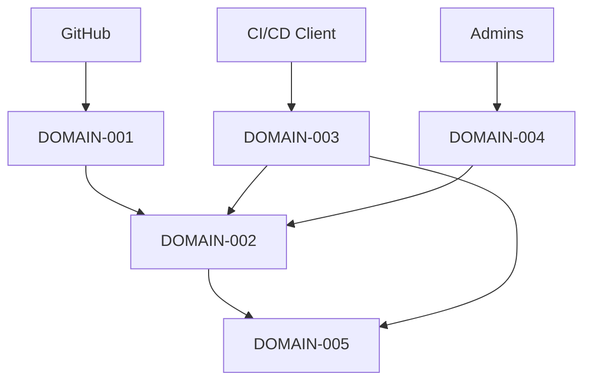

# Functional Domain Map

## 1. Introducción
Mapa funcional del producto para separar responsabilidades, facilitar escalado y planificar releases incrementales.

## 2. Bloques funcionales
### DOMAIN-001: Integración Git
- Descripción: Gestión de webhooks, autenticación, lectura de diffs y publicación de comentarios.
- Requisitos asociados (FR/NFR): FR-001 FR-003 FR-008 NFR-011
- Complejidad: Media
- Dependencias: GitHub API

### DOMAIN-002: Motor de Análisis IA
- Descripción: Construcción de prompts, invocación de modelos y normalización de resultados.
- Requisitos asociados (FR/NFR): FR-002 FR-005 FR-012 FR-015 NFR-002
- Complejidad: Alta
- Dependencias: AI Provider

### DOMAIN-003: API y Seguridad
- Descripción: API REST, autenticación, autorización y rate limiting.
- Requisitos asociados (FR/NFR): FR-007 FR-010 FR-011 NFR-004
- Complejidad: Media
- Dependencias: API Gateway

### DOMAIN-004: Configuración y Gobierno
- Descripción: Parámetros por repositorio, políticas, límites y activación.
- Requisitos asociados (FR/NFR): FR-009 FR-011 FR-014 NFR-009
- Complejidad: Media
- Dependencias: Base de datos

### DOMAIN-005: Observabilidad y Analytics
- Descripción: Logs, métricas, trazabilidad, costes y uso.
- Requisitos asociados (FR/NFR): FR-010 NFR-008 NFR-010
- Complejidad: Media
- Dependencias: Stack observabilidad

## 3. Mapa general de dominios
