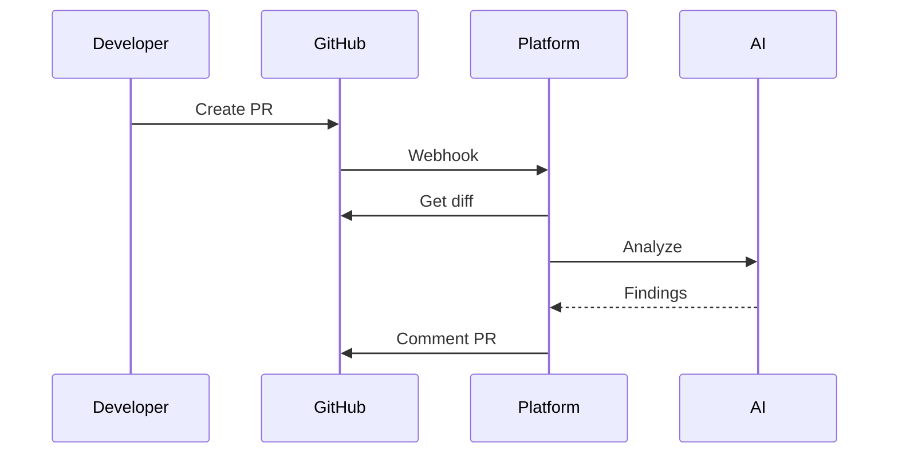

# Business Flows

## 1. Introducción
Flujos operativos principales del producto.

## 2. Flujos
### FLOW-001: Análisis automático PR
- Actor principal: Developer
- Objetivo: Obtener revisión automática
- Descripción: Evento Git dispara análisis y comentario.
- Flujo principal:
  1. Crear PR.
  2. Recibir webhook.
  3. Obtener diff.
  4. Invocar IA.
  5. Publicar resultados.
- Alternativas:
- Eventos clave: Timeout IA, error permisos

### FLOW-002: Análisis vía API
- Actor principal: CI/CD System
- Objetivo: Ejecutar análisis desde pipeline
- Descripción: Pipeline invoca API protegida.
- Flujo principal:
  1. Enviar request.
  2. Validar clave.
  3. Analizar.
  4. Responder.
- Alternativas:
- Eventos clave: cuota excedida