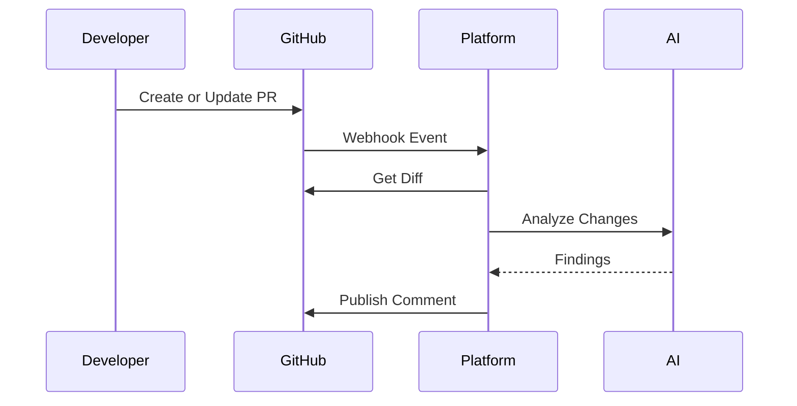
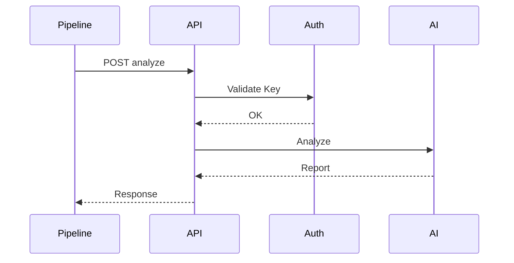
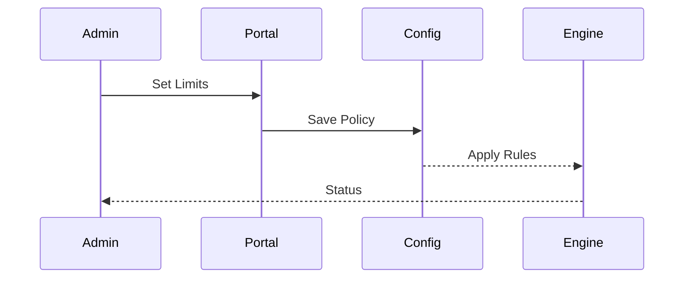

# Business Flows

## 1. Introducción
Se describen los flujos operativos principales del sistema para automatizar revisiones y controlar operación.

## 2. Flujos de negocio
### FLOW-001: Análisis automático de Pull Request
**Actor principal:** Developer  
**Objetivo:** Obtener revisión automática antes del merge.  
**Descripción:** Un evento Git dispara el análisis del diff y publicación de resultados.  
**Flujo principal:**  
1. Se crea o actualiza PR.  
2. GitHub envía webhook.  
3. El sistema obtiene diff.  
4. Se construye prompt.  
5. Se invoca IA.  
6. Se genera informe.  
7. Se publica comentario.  
**Flujos alternativos:**  
- PR sin cambios relevantes.  
- Timeout del proveedor IA.  
**Eventos clave:**  
- Nuevo PR recibido.

### FLOW-002: Análisis vía API REST
**Actor principal:** CI CD System  
**Objetivo:** Ejecutar revisión desde pipeline.  
**Descripción:** Un cliente autenticado envía código o diff para revisión.  
**Flujo principal:**  
1. Cliente envía request.  
2. Sistema valida API key.  
3. Se genera prompt.  
4. Se invoca IA.  
5. Se responde informe.  
**Flujos alternativos:**  
- API key inválida.  
- Cuota excedida.  
**Eventos clave:**  
- Request autenticada.

### FLOW-003: Control de costes y activación
**Actor principal:** Organization Admin  
**Objetivo:** Mantener consumo bajo presupuesto.  
**Descripción:** El administrador configura límites y políticas.  
**Flujo principal:**  
1. Define cuota.  
2. Guarda configuración.  
3. Sistema aplica reglas.  
4. Se bloquean excesos.  
**Flujos alternativos:**  
- Cambio temporal de cuota.  
- Excepción manual.  
**Eventos clave:**  
- Límite superado.

