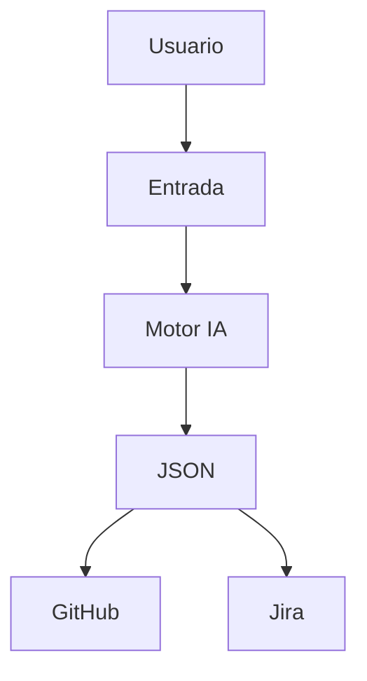

# Functional Domain Map

## 1. Introducción
Mapa de capacidades principales.

## 2. Bloques funcionales
### DOMAIN-001: Entrada de requisitos
- Descripción: Captura y validación.
- Requisitos asociados (FR/NFR)
- Complejidad: Media
- Dependencias: UI/API

### DOMAIN-002: Motor IA
- Descripción: Prompting y generación.
- Requisitos asociados (FR/NFR)
- Complejidad: Alta
- Dependencias: Proveedor IA

## 3. Mapa general de dominios
