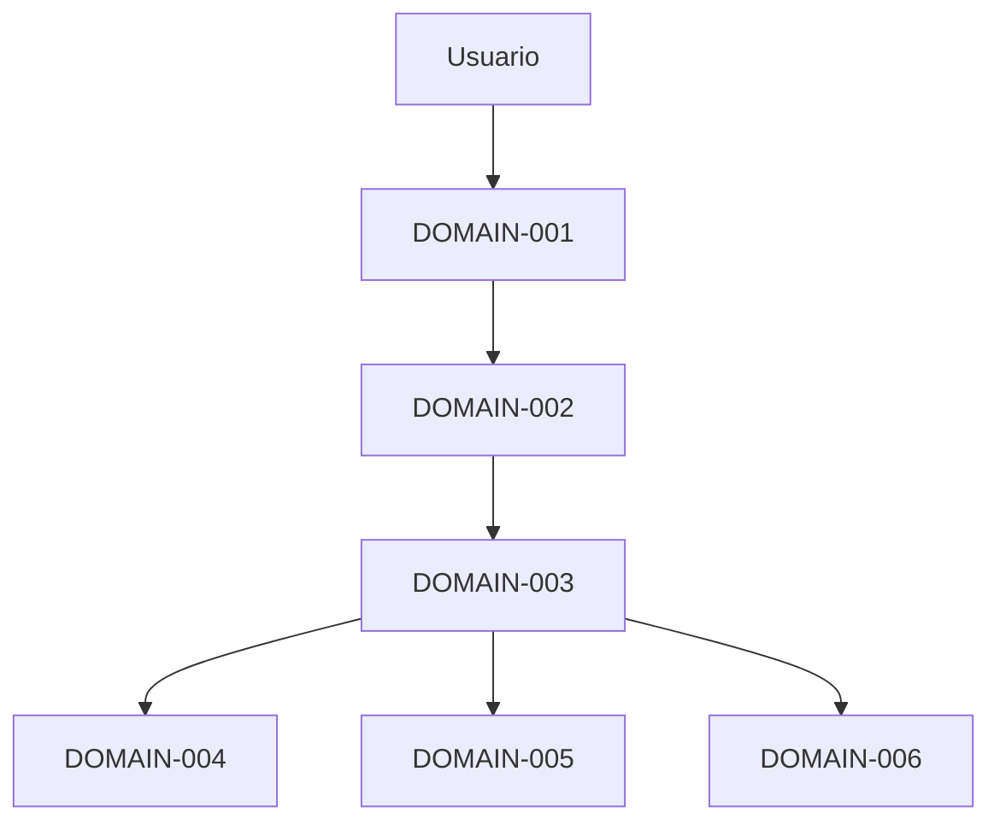

# Functional Domain Map

## 1. Introducción
El sistema se divide en dominios funcionales desacoplados para asegurar mantenibilidad, trazabilidad y evolución futura.

## 2. Bloques funcionales
### DOMAIN-001: Gestión de Entrada de Requisitos
- Descripción: Captura, validación y normalización de requisitos.
- Requisitos asociados (FR/NFR): FR-001 FR-002 NFR-009
- Complejidad: Media
- Dependencias: UI/API de entrada

### DOMAIN-002: Orquestación IA
- Descripción: Construcción de prompts, invocación de IA y recepción de resultados.
- Requisitos asociados (FR/NFR): FR-003 FR-004 FR-015 NFR-002
- Complejidad: Alta
- Dependencias: API IA externa

### DOMAIN-003: Generador de Artefactos JSON
- Descripción: Ensamblado y validación del JSON final con documentos pipeline.
- Requisitos asociados (FR/NFR): FR-005 FR-006 FR-014 NFR-009
- Complejidad: Alta
- Dependencias: JSON Schema

### DOMAIN-004: Integración GitHub
- Descripción: Publicación automática en repositorios, issues y documentación.
- Requisitos asociados (FR/NFR): FR-016 NFR-008
- Complejidad: Media
- Dependencias: GitHub API

### DOMAIN-005: Integración Jira
- Descripción: Creación de épicas, historias, tareas y backlog.
- Requisitos asociados (FR/NFR): FR-017 NFR-008
- Complejidad: Media
- Dependencias: Jira API

### DOMAIN-006: Automatización Python
- Descripción: Scripts de ejecución y despliegue de integraciones.
- Requisitos asociados (FR/NFR): FR-018 NFR-007
- Complejidad: Media
- Dependencias: Runtime Python

## 3. Mapa general de dominios
