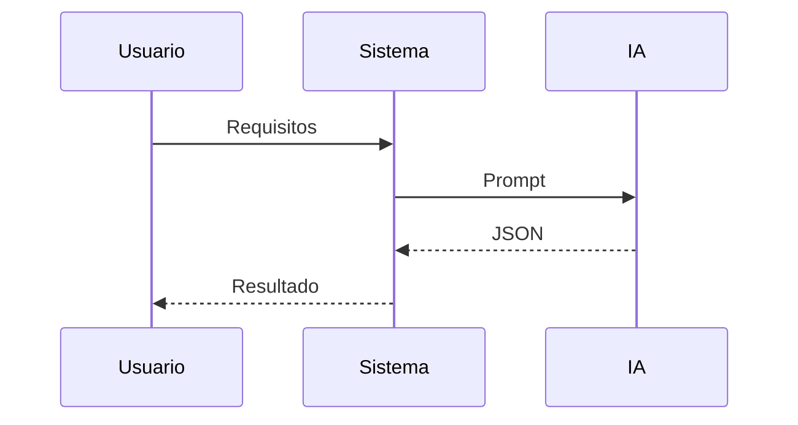

# Business Flows

## 1. Introducción
Flujos operativos principales.

## 2. Flujos de negocio
### FLOW-001: Generar análisis
**Actor principal:** Usuario  
**Objetivo:** Obtener JSON completo  
**Descripción:** Sistema procesa requisitos y genera artefactos.  
**Flujo principal:**  
1. Enviar requisitos  
2. Generar prompt  
3. Invocar IA  
4. Validar JSON  
**Flujos alternativos:**  
- Error IA  
- JSON inválido  
**Eventos clave:**  
- Resultado disponible

