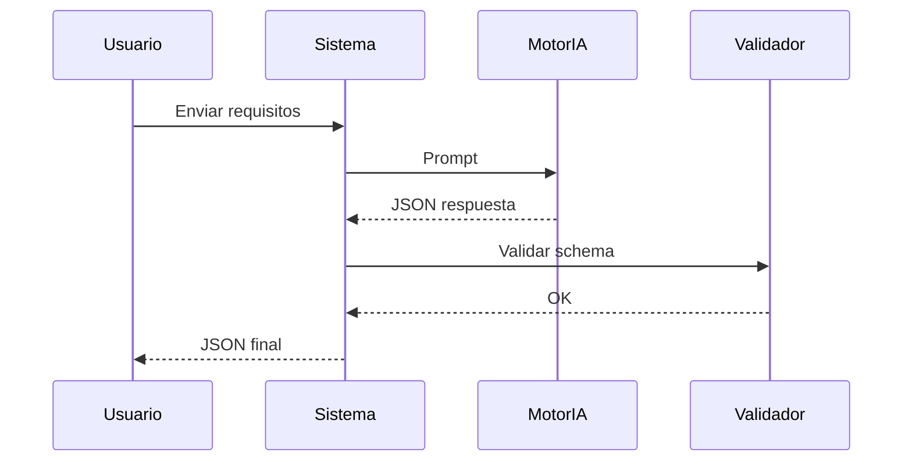
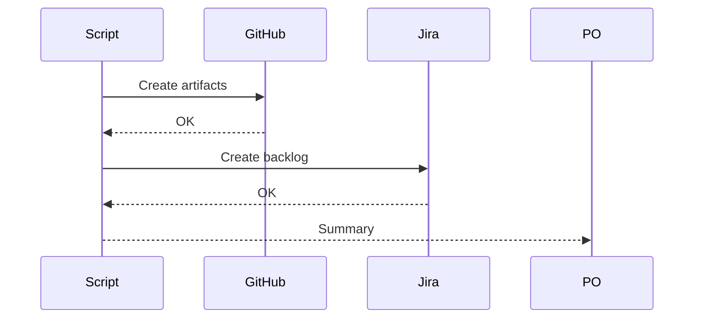

# Business Flows

## 1. Introducción
Los flujos cubren generación del análisis y publicación automatizada en herramientas de delivery.

## 2. Flujos de negocio
### FLOW-001: Generación de pipeline documental
**Actor principal:** Usuario solicitante  
**Objetivo:** Obtener análisis completo del proyecto.  
**Descripción:** El sistema procesa requisitos y solicita a IA un JSON estructurado.  
**Flujo principal:**  
1. Usuario introduce requisitos.  
2. Sistema valida entrada.  
3. Se genera prompt.  
4. Se invoca IA.  
5. Se valida JSON.  
6. Se entrega resultado.  
**Flujos alternativos:**  
- JSON inválido y reintento automático.  
- Requisitos incompletos.  
**Eventos clave:**  
- Respuesta IA recibida.

### FLOW-002: Publicación GitHub y Jira
**Actor principal:** Product Owner  
**Objetivo:** Cargar artefactos automáticamente.  
**Descripción:** El script Python usa el JSON para crear elementos en herramientas destino.  
**Flujo principal:**  
1. Leer JSON.  
2. Autenticar GitHub.  
3. Crear contenidos GitHub.  
4. Autenticar Jira.  
5. Crear backlog Jira.  
6. Confirmar operación.  
**Flujos alternativos:**  
- Error autenticación.  
- Elementos parcialmente creados.  
**Eventos clave:**  
- Integración completada.

