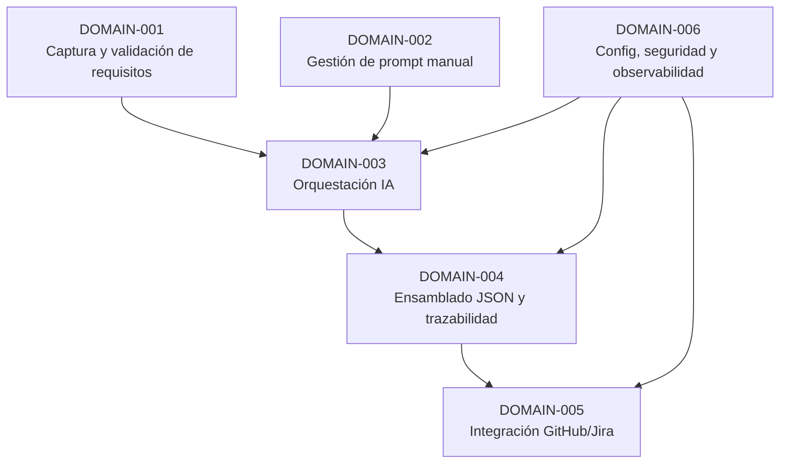

# Functional Domain Map

## 1. Introducción

Este documento descompone la solución en dominios funcionales coherentes, alineados con los requisitos FR-001 a FR-007 y los NFR definidos. El objetivo es facilitar la comprensión del sistema, la asignación de responsabilidades y la trazabilidad entre requisitos, componentes y artefactos generados por la IA.

## 2. Bloques funcionales

### DOMAIN-001 – Captura y validación de requisitos
- Descripción: Gestión de la entrada de requisitos funcionales del usuario, validación básica (campos obligatorios, formato) y normalización a un modelo interno.
- Requisitos asociados: FR-001, NFR-005.
- Complejidad: Baja-media.
- Dependencias: Ninguna externa directa; puede depender de almacenamiento interno si se persisten requisitos.

### DOMAIN-002 – Gestión de prompt manual
- Descripción: Soporte para introducir, editar y validar un prompt manual basado en una plantilla, incluyendo guardrails de arquitectura y anti-sesgo.
- Requisitos asociados: FR-002, FR-007, NFR-006.
- Complejidad: Media (plantillas, validaciones, versionado ligero).
- Dependencias: DOMAIN-001 (para asociar prompt a requisitos).

### DOMAIN-003 – Orquestación de llamada a la IA
- Descripción: Composición de la entrada a la IA (requisitos + prompt), invocación al modelo y gestión de respuestas y errores.
- Requisitos asociados: FR-003, NFR-003, NFR-004.
- Complejidad: Media.
- Dependencias: DOMAIN-001, DOMAIN-002, proveedor de IA (API externa).

### DOMAIN-004 – Ensamblado del JSON y trazabilidad
- Descripción: Construcción del JSON unificado con los documentos DOC00–DOC10, aplicación del esquema versionado y generación de enlaces de trazabilidad entre requisitos y artefactos.
- Requisitos asociados: FR-004, FR-005, NFR-001, NFR-003, NFR-005.
- Complejidad: Media.
- Dependencias: DOMAIN-003 (salida de IA), definición de esquema JSON.

### DOMAIN-005 – Integración con GitHub y Jira
- Descripción: Script en Python que consume el JSON y crea/actualiza artefactos en GitHub y Jira, gestionando autenticación, errores y logging.
- Requisitos asociados: FR-006, NFR-002, NFR-004.
- Complejidad: Media.
- Dependencias: DOMAIN-004 (JSON final), APIs de GitHub y Jira.

### DOMAIN-006 – Configuración, seguridad y observabilidad
- Descripción: Gestión de configuración (proyectos destino, URLs de APIs, parámetros), credenciales, logging y auditoría básica.
- Requisitos asociados: NFR-002, NFR-003, NFR-004, NFR-005.
- Complejidad: Media.
- Dependencias: Todos los dominios que consumen configuración y credenciales.

## 3. Mapa general de dominios

