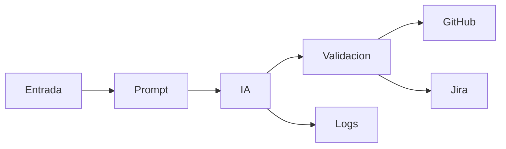

# Dominios funcionales
## DOMAIN-001 Gestión de Entrada
Descripción: Captura requisitos y metadatos.
RF asociados: FR-001.
Complejidad: Baja.

## DOMAIN-002 Gestión de Prompt
Descripción: Versionado y selección de prompt.
RF asociados: FR-002.
Complejidad: Media.

## DOMAIN-003 Orquestación IA
Descripción: Construcción request, llamada modelo, retries.
RF asociados: FR-003 FR-004.
Complejidad: Media.

## DOMAIN-004 Validación y Trazabilidad
Descripción: JSON Schema, referencias cruzadas.
RF asociados: FR-005 FR-010.
Complejidad: Alta.

## DOMAIN-005 Integraciones Externas
Descripción: GitHub y Jira.
RF asociados: FR-006 FR-007 FR-008.
Complejidad: Media.

## DOMAIN-006 Observabilidad y Seguridad
Descripción: Logs, secretos, auditoría.
RF asociados: FR-009.
Complejidad: Media.

