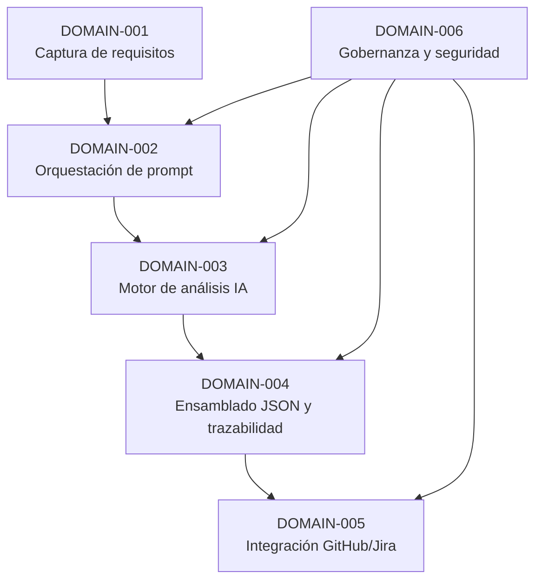

# Functional Domain Map

## 1. Introducción

Este documento descompone la solución en dominios funcionales principales, alineados con los requisitos FR-001 a FR-007 y los NFR asociados. Cada dominio agrupa responsabilidades coherentes y facilita la trazabilidad entre requisitos, componentes y artefactos generados.

## 2. Bloques funcionales

### DOMAIN-001 – Captura y normalización de requisitos
- Descripción: Gestión de la entrada de requisitos del usuario, validación básica y normalización a un formato interno estructurado.
- Requisitos asociados: FR-001, FR-004, NFR-005.
- Complejidad: Baja-media (validaciones, mapeo de campos, posibles plantillas).
- Dependencias: Ninguna externa directa; depende de almacenamiento interno si se requiere persistencia.

### DOMAIN-002 – Orquestación de prompt y reglas de análisis
- Descripción: Construcción del prompt para la IA, incluyendo reglas de trazabilidad, anti-sesgo y anti-sobredimensionamiento.
- Requisitos asociados: FR-002, FR-007, NFR-003, NFR-006.
- Complejidad: Media (plantillas de prompt, versionado, parametrización por proyecto).
- Dependencias: DOMAIN-001 (requisitos normalizados), configuración de políticas.

### DOMAIN-003 – Motor de análisis IA
- Descripción: Interacción con el modelo de IA para generar los documentos DOC0–DOC9 a partir del prompt.
- Requisitos asociados: FR-003, NFR-001, NFR-004.
- Complejidad: Media (gestión de llamadas, tamaños de contexto, manejo de errores).
- Dependencias: DOMAIN-002 (prompt), proveedor de IA (API externa).

### DOMAIN-004 – Ensamblado y trazabilidad del JSON
- Descripción: Construcción del JSON unificado con todos los documentos, metadatos y enlaces de trazabilidad entre requisitos y artefactos.
- Requisitos asociados: FR-004, FR-005, NFR-003, NFR-005.
- Complejidad: Media (modelo de datos, referencias cruzadas, validación de esquema).
- Dependencias: DOMAIN-003 (salida de IA), esquema JSON.

### DOMAIN-005 – Integración con GitHub y Jira
- Descripción: Consumo del JSON para crear/actualizar artefactos en GitHub y Jira mediante un script en Python.
- Requisitos asociados: FR-006, FR-005, NFR-002, NFR-004.
- Complejidad: Media (APIs externas, autenticación, mapeo de campos, manejo de errores).
- Dependencias: DOMAIN-004 (JSON final), APIs de GitHub y Jira.

### DOMAIN-006 – Gobernanza, configuración y seguridad
- Descripción: Gestión de configuración (proyectos destino, plantillas), credenciales, logging y auditoría.
- Requisitos asociados: NFR-002, NFR-003, NFR-004, NFR-005.
- Complejidad: Media (seguridad, configuración multi-entorno).
- Dependencias: Todos los dominios que consumen configuración y credenciales.

## 3. Mapa general de dominios

