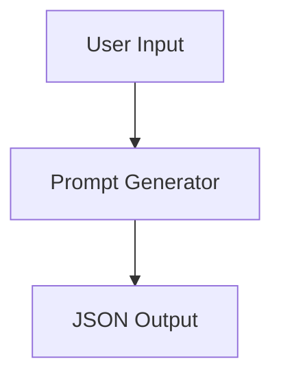

# Functional Domain Map
## 1. Introducción
Mapa de dominios funcionales del sistema generador de prompts.
## 2. Bloques funcionales
### DOMAIN-001 PromptGenerator
- Descripción: Genera prompt estructurado.
- Requisitos: FR-001, FR-002.
- Complejidad: Media.
- Dependencias: Ninguna.
## 3. Mapa

