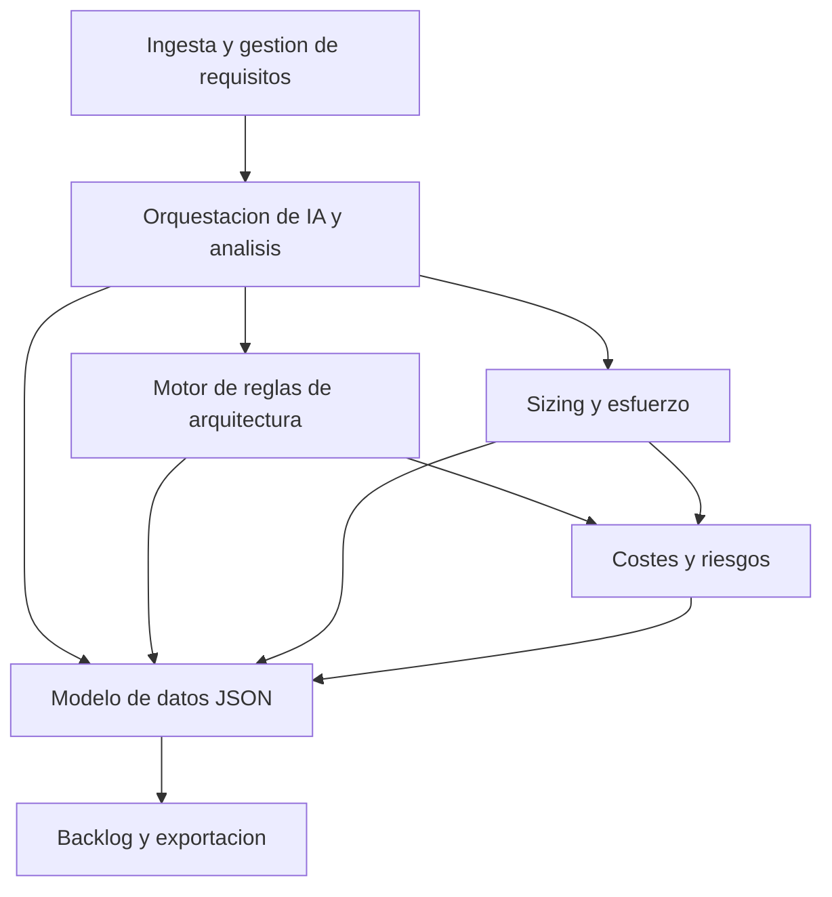

# Functional Domain Map

## 1. Introducción
Este documento descompone el sistema en dominios funcionales principales para estructurar el análisis, la trazabilidad y la futura implementación. Cada dominio agrupa requisitos funcionales relacionados y sirve de base para el sizing, la arquitectura y el backlog.

## 2. Bloques funcionales

### DOMAIN-001 – Ingesta y gestión de requisitos
- **Descripción:** Domina la captura, almacenamiento y gestión de los requisitos funcionales proporcionados por el usuario, incluyendo su identificación y formato.
- **Requisitos asociados:** FR-001, FR-004, NFR-005.
- **Complejidad:** Media (requiere modelado de requisitos y trazabilidad básica).
- **Dependencias:** DOMAIN-002 (para preparar la entrada a la IA), DOMAIN-004 (para trazabilidad en el JSON).

### DOMAIN-002 – Orquestación de IA y generación de análisis
- **Descripción:** Se encarga de construir el prompt, invocar la IA con los requisitos y recibir el análisis inicial estructurado.
- **Requisitos asociados:** FR-002, FR-003, NFR-001, NFR-002.
- **Complejidad:** Media-alta (interacción con IA, control de formato JSON, manejo de errores).
- **Dependencias:** DOMAIN-001 (requisitos de entrada), DOMAIN-003 (reglas anti-sobredimensionamiento), DOMAIN-004 (esquema JSON).

### DOMAIN-003 – Motor de reglas de arquitectura y anti-sobredimensionamiento
- **Descripción:** Aplica reglas para seleccionar arquitecturas y stacks proporcionales al tamaño y complejidad del proyecto, evitando sobredimensionamiento.
- **Requisitos asociados:** NFR-001, FR-002 (como condicionante del análisis), FR-003.
- **Complejidad:** Media (reglas de decisión, parámetros de tamaño, RNF).
- **Dependencias:** DOMAIN-002 (análisis de requisitos), DOMAIN-005 (sizing), DOMAIN-006 (costes).

### DOMAIN-004 – Modelo de datos y generación de JSON unificado
- **Descripción:** Define y aplica el esquema JSON de salida, consolidando todos los documentos DOC00–DOC10 en un único artefacto.
- **Requisitos asociados:** FR-003, FR-004, FR-007, NFR-002.
- **Complejidad:** Media (diseño de esquema, validación, versionado).
- **Dependencias:** DOMAIN-001, DOMAIN-002, DOMAIN-003, DOMAIN-005, DOMAIN-006, DOMAIN-007.

### DOMAIN-005 – Sizing y estimación de esfuerzo
- **Descripción:** Calcula el tamaño del proyecto y las estimaciones de esfuerzo, incluyendo la relación con Story Points.
- **Requisitos asociados:** FR-002 (información de análisis), FR-003, NFR-001.
- **Complejidad:** Media (modelo de sizing, criterios de clasificación SMALL/MEDIUM/LARGE).
- **Dependencias:** DOMAIN-002 (análisis funcional), DOMAIN-004 (inclusión en JSON), DOMAIN-006 (costes).

### DOMAIN-006 – Estimación de costes y riesgos
- **Descripción:** Estima costes por bloque funcional, arquitectura, infraestructura, integraciones y mantenimiento, y registra riesgos y dependencias.
- **Requisitos asociados:** FR-003, NFR-001, NFR-002.
- **Complejidad:** Media.
- **Dependencias:** DOMAIN-002, DOMAIN-003, DOMAIN-005, DOMAIN-004.

### DOMAIN-007 – Backlog y exportación a herramientas externas
- **Descripción:** Genera el backlog inicial (épicas, historias, tareas, spikes) y soporta la exportación a GitHub y Jira mediante el script en Python.
- **Requisitos asociados:** FR-005, FR-006, FR-007, NFR-003, NFR-004.
- **Complejidad:** Media-alta (mapeo a estructuras de Jira, convenciones de GitHub).
- **Dependencias:** DOMAIN-004 (JSON unificado), DOMAIN-006 (riesgos y costes), DOMAIN-001 (trazabilidad a requisitos).

## 3. Mapa general de dominios

