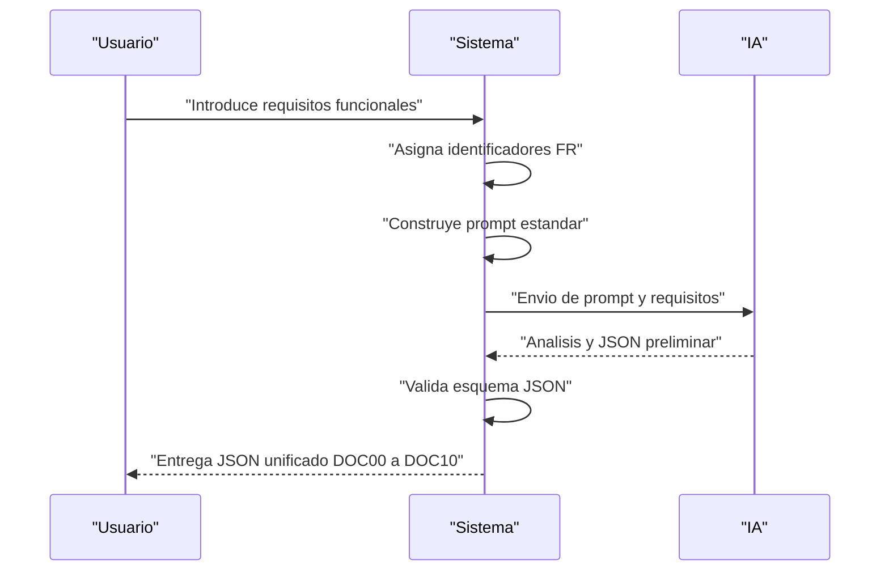
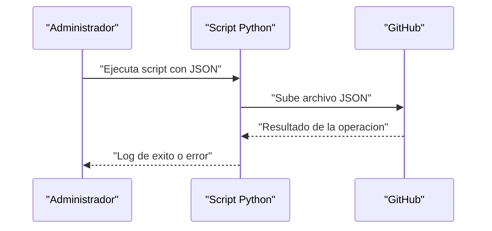
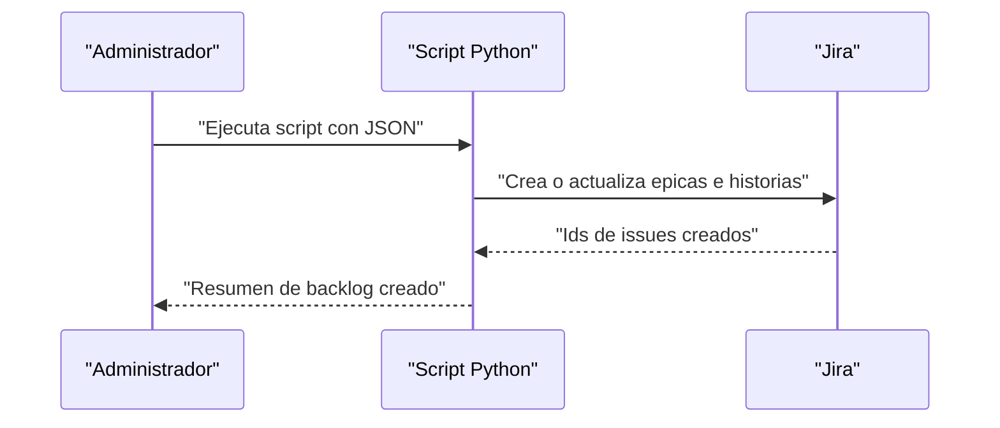

# Business Flows

## 1. Introducción
Este documento describe los flujos de negocio clave del sistema, desde la introducción de requisitos hasta la publicación del JSON en GitHub y la creación del backlog en Jira. Los flujos se apoyan en los dominios funcionales definidos en DOC2 y mantienen trazabilidad con los requisitos funcionales.

## 2. Flujos

### FLOW-001 – Generación de análisis y JSON unificado
- **Actor principal:** ACT-001 – Usuario analista / Product Owner.
- **Objetivo:** Obtener un análisis inicial completo de la solución en un único JSON estructurado.
- **Flujo principal:**
  1. El usuario prepara los requisitos funcionales y los introduce en el sistema (FR-001).
  2. El sistema asigna identificadores únicos a cada requisito.
  3. El sistema construye el prompt estándar, incorporando los requisitos y las reglas anti-sobredimensionamiento.
  4. El sistema envía el prompt y los requisitos a la IA (FR-002).
  5. La IA genera el análisis inicial, incluyendo DOC00–DOC10.
  6. El sistema valida que la salida cumple el esquema JSON definido (FR-007).
  7. El sistema consolida la salida en un único JSON versionado (FR-003).
- **Alternativas:**
  - Si la validación de esquema falla, se registra un error y se notifica al usuario para revisar el prompt o los requisitos.
- **Eventos clave:**
  - Generación de identificadores de requisitos.
  - Validación de esquema JSON.
  - Versión del JSON generada.

### FLOW-002 – Publicación del JSON en GitHub
- **Actor principal:** ACT-003 – Administrador de herramientas / DevOps.
- **Objetivo:** Subir el JSON generado a un repositorio GitHub como artefacto versionado.
- **Flujo principal:**
  1. El administrador configura las credenciales de GitHub para el script en Python (FR-005, NFR-003).
  2. El script recibe la ruta del JSON validado.
  3. El script crea o actualiza el archivo en el repositorio (por ejemplo, en una rama o carpeta específica).
  4. El script registra el resultado de la operación (éxito o error).
- **Alternativas:**
  - Si la subida falla, el script devuelve un mensaje de error y no modifica el repositorio.
- **Eventos clave:**
  - Ejecución del script.
  - Confirmación de subida en GitHub.

### FLOW-003 – Creación de backlog en Jira
- **Actor principal:** ACT-003 – Administrador de herramientas / DevOps.
- **Objetivo:** Crear o actualizar issues en Jira a partir del backlog contenido en el JSON.
- **Flujo principal:**
  1. El administrador configura las credenciales y parámetros de Jira (proyecto, tipos de issue).
  2. El script en Python lee la sección de backlog del JSON (DOC9).
  3. El script crea o actualiza épicas, historias y tareas en Jira, manteniendo la trazabilidad con los identificadores de requisitos.
  4. El script registra los identificadores de issues creados/actualizados.
- **Alternativas:**
  - Si algún issue no puede crearse por validación de Jira, se registra el error y se continúa con el resto.
- **Eventos clave:**
  - Creación de épicas.
  - Creación de historias y tareas.
  - Asociación de issues a requisitos.

