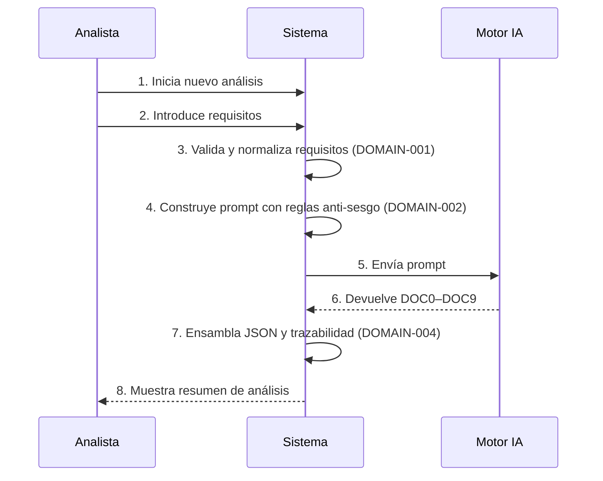
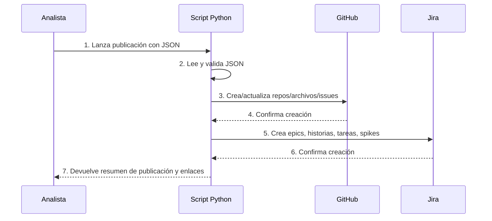

# Business Flows

## 1. Introducción

Este documento describe los flujos de negocio clave de la solución, centrados en la ejecución del análisis mediante IA y la posterior integración con GitHub y Jira. Cada flujo mantiene trazabilidad con los requisitos funcionales y los dominios definidos.

## 2. Flujos

### FLOW-001 – Ejecución completa de análisis IA
- Actor principal: Analista funcional / Product Owner.
- Objetivo: Generar un análisis completo de proyecto (DOC0–DOC9) a partir de requisitos de usuario, en un único JSON trazable.
- Flujo principal:
  1. El analista accede al sistema y selecciona "Nuevo análisis".
  2. El analista introduce o carga los requisitos funcionales (FR-001).
  3. El sistema valida el formato y consistencia básica de los requisitos (DOMAIN-001).
  4. El sistema construye el prompt estructurado, incluyendo reglas de trazabilidad y anti-sesgo (FR-002, FR-007, DOMAIN-002).
  5. El sistema envía el prompt al modelo de IA y espera la respuesta (FR-003, DOMAIN-003).
  6. El sistema recibe los documentos generados (DOC0–DOC9) y los valida mínimamente (estructura, campos obligatorios).
  7. El sistema ensambla el JSON unificado, añadiendo metadatos y enlaces de trazabilidad (FR-004, FR-005, DOMAIN-004).
  8. El sistema presenta un resumen del análisis al analista para revisión.
- Alternativas:
  - 4A: El prompt excede límites de tamaño del modelo de IA → el sistema notifica al usuario y propone dividir el análisis.
  - 5A: Error en la llamada a la IA → el sistema reintenta o informa del fallo con detalle.
  - 6A: El JSON devuelto no cumple el esquema esperado → el sistema intenta corregir o solicita una nueva generación.
- Eventos clave:
  - E1: Requisitos validados.
  - E2: Prompt generado y versionado.
  - E3: Respuesta de IA recibida.
  - E4: JSON final ensamblado.

### FLOW-002 – Publicación del análisis en GitHub y Jira
- Actor principal: Analista funcional / Product Owner.
- Objetivo: Publicar el análisis generado en los sistemas de gestión (GitHub y Jira) para su uso por el equipo de desarrollo.
- Flujo principal:
  1. El analista revisa el análisis generado y lo aprueba.
  2. El analista lanza el proceso de publicación (por ejemplo, ejecutando el script en Python o pulsando un botón que lo dispare).
  3. El script en Python lee el JSON unificado (FR-006, DOMAIN-005).
  4. El script crea o actualiza ficheros y/o issues en GitHub (por ejemplo, repositorio de documentación, issues para tareas clave).
  5. El script crea epics, historias de usuario, tareas y spikes en Jira a partir del backlog (DOC9).
  6. El script registra identificadores de GitHub/Jira en el JSON o en un log de auditoría para mantener trazabilidad.
- Alternativas:
  - 4A: Error de autenticación en GitHub → el script aborta y notifica al usuario.
  - 5A: Error de autenticación o validación en Jira → el script registra el error y permite reintento.
  - 6A: Algunos artefactos se crean correctamente y otros fallan → el script genera un informe parcial.
- Eventos clave:
  - E5: Aprobación del análisis.
  - E6: Artefactos creados en GitHub.
  - E7: Artefactos creados en Jira.

