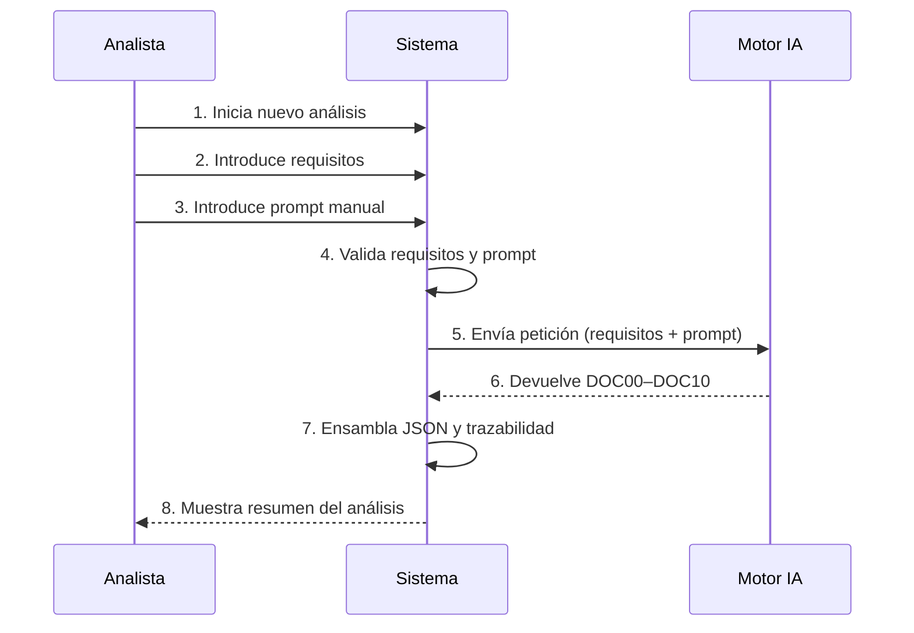
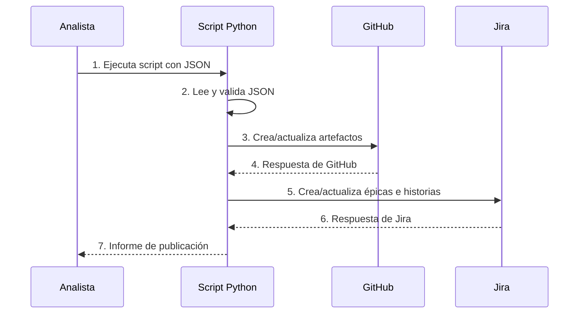

# Business Flows

## 1. Introducción

Este documento describe los flujos de negocio principales del sistema: la ejecución del análisis mediante IA a partir de requisitos y prompt manual, y la publicación del resultado en GitHub y Jira. Cada flujo se vincula a los dominios funcionales y requisitos relevantes.

## 2. Flujos

### FLOW-001 – Ejecución de análisis IA
- Actor principal: Analista funcional / Product Owner.
- Objetivo: Generar un análisis completo de la solución (DOC00–DOC10) en un único JSON trazable, a partir de requisitos y un prompt manual.
- Flujo principal:
  1. El analista accede al sistema y selecciona "Nuevo análisis".
  2. El analista introduce o carga los requisitos funcionales (FR-001, DOMAIN-001).
  3. El analista introduce o selecciona un prompt manual basado en la plantilla definida (FR-002, FR-007, DOMAIN-002).
  4. El sistema valida requisitos y prompt (formato, campos mínimos, coherencia básica).
  5. El sistema compone la petición a la IA con requisitos y prompt (DOMAIN-003).
  6. El sistema invoca a la IA y espera la respuesta (FR-003).
  7. El sistema recibe los documentos DOC00–DOC10 y verifica su estructura.
  8. El sistema ensambla el JSON unificado, aplica el esquema y genera enlaces de trazabilidad (FR-004, FR-005, DOMAIN-004).
  9. El sistema presenta un resumen del análisis al analista para revisión.
- Alternativas:
  - 4A: La validación de requisitos o prompt falla → el sistema muestra errores y solicita correcciones.
  - 6A: La llamada a la IA falla (timeout, error de API) → el sistema reintenta o informa del fallo.
  - 7A: La respuesta de la IA no cumple el esquema → el sistema intenta corregir o solicita una nueva generación.
- Eventos clave:
  - E1: Requisitos y prompt validados.
  - E2: Respuesta de IA recibida.
  - E3: JSON unificado generado.

### FLOW-002 – Publicación del análisis en GitHub y Jira
- Actor principal: Analista funcional / Product Owner.
- Objetivo: Publicar el análisis generado en GitHub y Jira para que el equipo de desarrollo pueda trabajar con los artefactos.
- Flujo principal:
  1. El analista revisa el análisis y aprueba el JSON generado.
  2. El analista ejecuta el script en Python, proporcionando la ruta o referencia al JSON (FR-006, DOMAIN-005).
  3. El script lee y valida el JSON contra el esquema.
  4. El script crea o actualiza artefactos en GitHub (por ejemplo, ficheros de documentación, issues para tareas clave).
  5. El script crea o actualiza épicas, historias, tareas y spikes en Jira a partir del backlog (DOC9).
  6. El script registra resultados (IDs creados, errores) en logs o en un informe.
- Alternativas:
  - 3A: El JSON no pasa la validación → el script aborta y notifica el problema.
  - 4A/5A: Error de autenticación o permisos en GitHub/Jira → el script registra el error y no continúa con esa parte.
- Eventos clave:
  - E4: JSON validado para publicación.
  - E5: Artefactos creados/actualizados en GitHub.
  - E6: Artefactos creados/actualizados en Jira.

