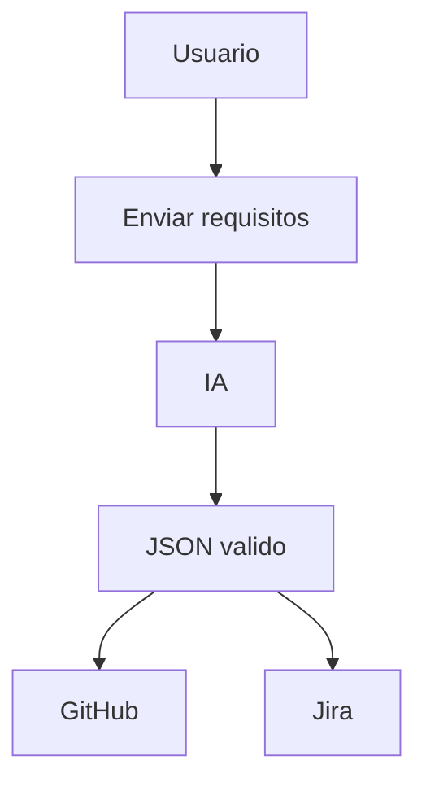

# FLOW-001 Generación de análisis
Actor: Analista
Objetivo: Obtener JSON completo.
Pasos:
1. Cargar requisitos.
2. Seleccionar prompt.
3. Ejecutar IA.
4. Validar esquema.
5. Descargar JSON.
Alternativas: Error IA, timeout, esquema inválido.

# FLOW-002 Publicación GitHub
Actor: DevOps
1. Ejecutar script Python.
2. Crear repo o branch.
3. Subir archivo JSON.
4. Crear commit.

# FLOW-003 Creación Jira
Actor: Product Owner
1. Leer JSON.
2. Crear épicas.
3. Crear historias.
4. Vincular trazabilidad.

