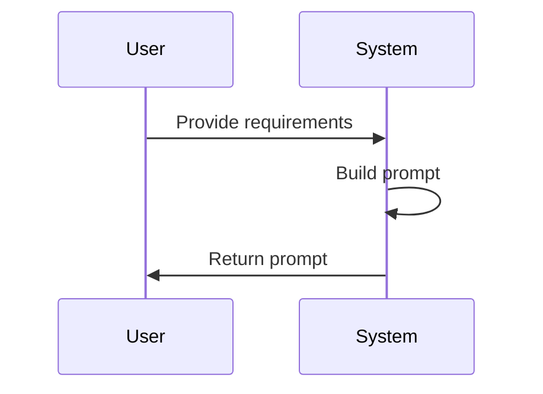

# Business Flows
## 1. Introducción
Flujos principales del sistema.
## 2. Flujos
### FLOW-001 Generación de Prompt
- Actor: Usuario.
- Objetivo: Obtener prompt.
- Flujo: Usuario ingresa requisitos → Sistema genera prompt.
- Alternativas: Requisitos incompletos.
- Eventos: Validación.

