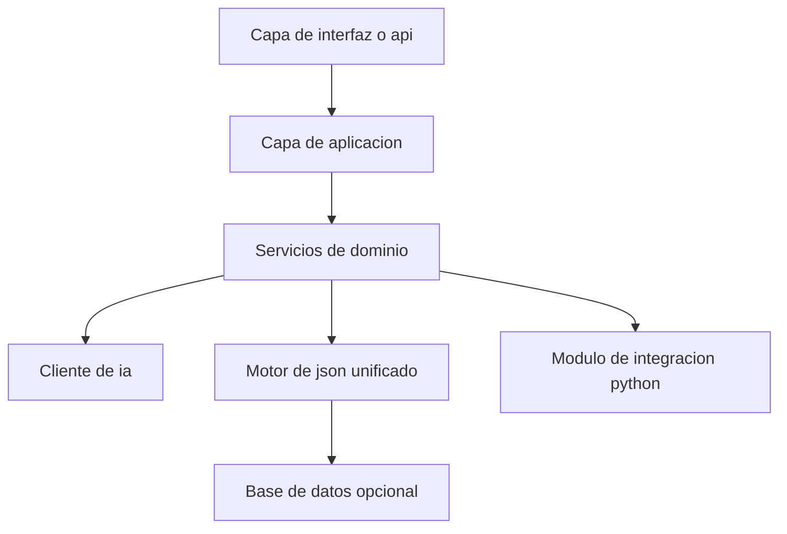
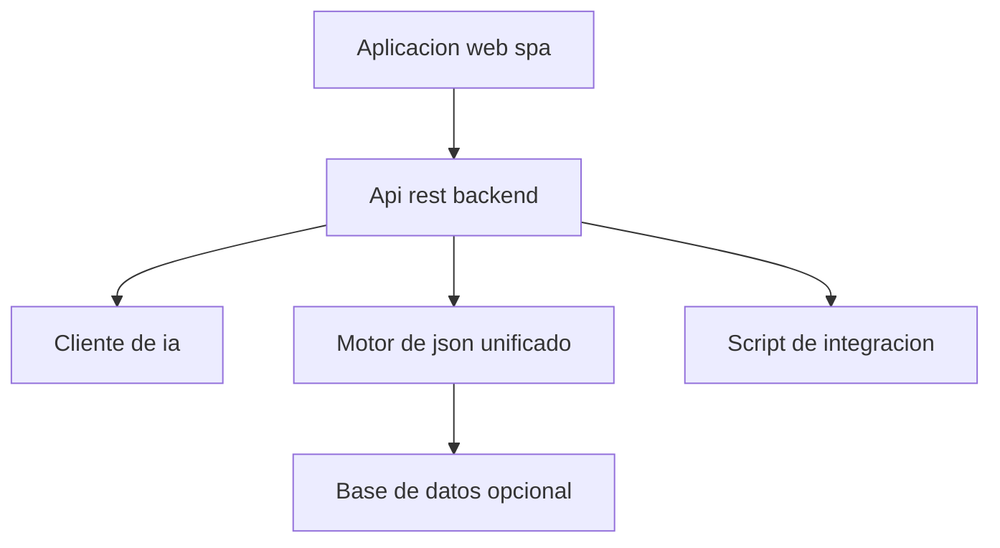

# Architecture Options

## 1. Evaluación previa de necesidad arquitectónica
- **Tamaño del proyecto:** MEDIUM (ver DOC4), con varios dominios funcionales pero baja concurrencia y volumen de datos.
- **Complejidad funcional:** Media, centrada en orquestación de IA, trazabilidad y generación de JSON estructurado.
- **RNF relevantes:**
  - NFR-001: Anti-sobredimensionamiento arquitectónico y tecnológico.
  - NFR-002: Confiabilidad del formato JSON.
  - NFR-003: Seguridad en credenciales de integración.
- **Riesgos de sobredimensionamiento:**
  - Introducir microservicios, Kubernetes o event streaming no aporta valor claro dado el uso esporádico y el bajo volumen.
  - Un stack excesivamente complejo aumentaría el coste de mantenimiento y la dificultad de operación.

## 2. Arquitecturas propuestas

### ARCH-OPT-001 – Monolito modular en capas (3-tier)
- **Nivel de complejidad:** Bajo-medio.
- **Justificación basada en requisitos:**
  - Suficiente para gestionar los dominios funcionales (ingesta, orquestación IA, JSON, integraciones) dentro de una única aplicación.
  - Facilita la trazabilidad y el control del esquema JSON en un solo código base.
- **Diagrama visual:**

- **Explicación del diagrama:**
  - Una capa de interfaz (API REST o CLI) expone operaciones para enviar requisitos y recuperar el JSON.
  - La capa de aplicación coordina los servicios de dominio (ingesta, orquestación IA, reglas de arquitectura, sizing, costes, backlog).
  - Un cliente de IA encapsula la comunicación con el proveedor de IA.
  - Un motor de JSON unificado consolida los documentos DOC00–DOC10.
  - Un módulo de integración en Python puede residir en el mismo repositorio o como componente separado pero simple.
- **Ventajas:**
  - Simplicidad de despliegue y operación.
  - Menor coste de desarrollo y mantenimiento.
  - Trazabilidad y lógica centralizadas.
- **Inconvenientes:**
  - Menor flexibilidad para escalar componentes de forma independiente (no necesario en este contexto).
  - Acoplamiento moderado entre dominios dentro de la misma base de código.
- **Riesgos:**
  - Si el proyecto creciera mucho en el futuro, podría requerir refactorización hacia una arquitectura más distribuida.
- **Coste relativo:** Bajo.
- **Adecuación al tamaño del proyecto:** Muy alta para un proyecto MEDIUM.

### ARCH-OPT-002 – Aplicación SPA ligera + API REST monolítica
- **Nivel de complejidad:** Medio.
- **Justificación basada en requisitos:**
  - Si se desea una experiencia de usuario más rica, una SPA (por ejemplo, React) puede consumir una API REST monolítica que implemente la lógica descrita en ARCH-OPT-001.
- **Diagrama visual:**

- **Explicación del diagrama:**
  - La SPA gestiona la interacción con el usuario (introducción de requisitos, visualización de resultados).
  - El backend REST implementa la orquestación de IA, la generación del JSON y la invocación del script de integración.
- **Ventajas:**
  - Mejor experiencia de usuario.
  - Separación clara entre frontend y backend.
- **Inconvenientes:**
  - Aumenta el esfuerzo de desarrollo (dos aplicaciones).
  - Puede ser innecesario si el uso es principalmente técnico.
- **Riesgos:**
  - Riesgo de sobredimensionar la interfaz si no se justifica una SPA completa.
- **Coste relativo:** Medio.
- **Adecuación al tamaño del proyecto:** Adecuada solo si se justifica una UI rica.

## 3. Pila tecnológica recomendada
- **Backend:** Python/FastAPI o Node.js/Express.
  - Justificación: Simplicidad, buena integración con scripts Python, ecosistema maduro.
  - Riesgos de sobredimensionamiento: Mínimos; se evita introducir frameworks pesados innecesarios.
  - Alternativa más simple: Un único servicio Python con FastAPI y el script de integración en el mismo repositorio.
- **Frontend:** Opcional. Si se requiere UI, React o Vue para una SPA ligera.
  - Alternativa más simple: Solo endpoints REST o CLI sin SPA.
- **Base de datos:** PostgreSQL o incluso almacenamiento de archivos JSON en disco si la persistencia es mínima.
  - Alternativa más simple: Persistencia en sistema de archivos versionado si no se requiere consulta compleja.
- **Infraestructura:** Contenedor Docker simple desplegado en una VM o servicio de contenedores básico.
  - Se evita Kubernetes y orquestadores complejos.
- **Integración:**
  - Cliente HTTP para IA.
  - SDKs oficiales o REST para GitHub y Jira.
- **Observabilidad:** Logging estructurado y métricas básicas (tiempos de respuesta, errores de integración).
- **Seguridad:**
  - Gestión de credenciales mediante variables de entorno o vault.
  - HTTPS en la exposición de la API.

## 4. Recomendación basada en simplicidad
Dado el tamaño MEDIUM, la baja concurrencia y la naturaleza analítica del sistema, se recomienda **ARCH-OPT-001 – Monolito modular en capas**, con backend en Python/FastAPI y script de integración en el mismo ecosistema. La opción SPA solo debería considerarse si se identifican requisitos claros de experiencia de usuario avanzada. No se recomienda el uso de microservicios, Kubernetes, event streaming ni stacks complejos.
