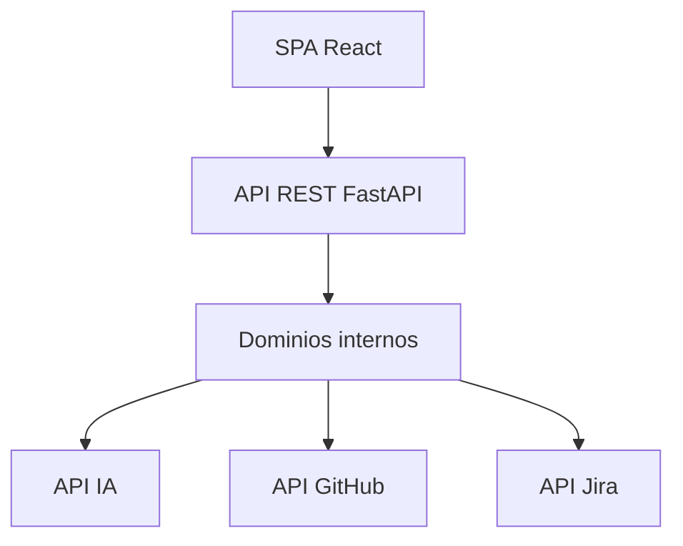

# Architecture Options

## 1. Evaluación previa de necesidad arquitectónica

- Tamaño del proyecto: MEDIUM (baja), con un número limitado de usuarios y ejecuciones.
- Complejidad funcional: Media, con 6 dominios bien definidos y varias integraciones externas.
- RNF relevantes:
  - NFR-001: Estabilidad del esquema JSON.
  - NFR-002: Seguridad en gestión de credenciales y acceso a APIs.
  - NFR-003: Rendimiento razonable, sin requisitos de tiempo real.
  - NFR-004: Robustez frente a errores de IA y APIs.
  - NFR-005: Extensibilidad.
  - NFR-006: Simplicidad arquitectónica y tecnológica.
- Riesgos de sobredimensionamiento:
  - Introducir microservicios, Kubernetes, mensajería compleja o stacks avanzados (Kafka, NoSQL distribuido) aumentaría el coste y la complejidad operativa sin beneficios claros para el volumen de uso previsto.

## 2. Arquitecturas propuestas

### ARCH-OPT-001 – Monolito modular en capas (Backend Python/FastAPI + CLI/script)
- Nivel de complejidad: Bajo-medio.
- Justificación basada en requisitos:
  - Adecuado para tamaño MEDIUM y equipo pequeño.
  - Python ya es requerido para el script de integración, lo que facilita reutilizar lenguaje y librerías.
  - Permite agrupar dominios en módulos internos (captura, prompt, IA, JSON, integraciones).
- Diagrama visual:

```mermaid
flowchart TD
  UI[UI sencilla / CLI] --> APP[Aplicación Backend (FastAPI)]
  APP --> MOD1[Modulo DOMAIN-001/002\nRequisitos y prompt]
  APP --> MOD2[Modulo DOMAIN-003\nOrquestación IA]
  APP --> MOD3[Modulo DOMAIN-004\nJSON y trazabilidad]
  APP --> MOD4[Modulo DOMAIN-005\nIntegración GitHub/Jira]
  APP --> MOD5[Modulo DOMAIN-006\nConfig y seguridad]
  MOD2 --> IA[API IA]
  MOD4 --> GH[API GitHub]
  MOD4 --> JI[API Jira]
```

- Explicación del diagrama:
  - Una aplicación backend monolítica (por ejemplo, FastAPI) expone una API o interfaz mínima para gestionar análisis.
  - Los módulos internos implementan los dominios funcionales.
  - El script Python de integración puede reutilizar parte de la lógica o ser un cliente de la API.
- Ventajas:
  - Simplicidad de despliegue (un solo servicio).
  - Coste de infraestructura bajo (una VM o contenedor simple).
  - Reutilización de lenguaje (Python) para backend y script.
- Inconvenientes:
  - Escalado principalmente vertical.
  - Despliegues acoplados (todo el sistema se despliega junto).
- Riesgos:
  - Si el producto crece mucho, podría requerir modularización más estricta o separación futura.
- Coste relativo: Bajo.
- Adecuación al tamaño del proyecto: Alta.

### ARCH-OPT-002 – Monolito modular con Clean Architecture (Backend Python/FastAPI + posible UI web ligera)
- Nivel de complejidad: Medio.
- Justificación basada en requisitos:
  - Refuerza la separación entre lógica de dominio (trazabilidad, ensamblado JSON) y detalles de infraestructura (IA, GitHub, Jira).
  - Facilita la extensibilidad (NFR-005) y pruebas.
- Diagrama visual:

```mermaid
flowchart TD
  UI[UI Web ligera / CLI] --> APP[Aplicación (Capa de Aplicación)]
  APP --> DOM[Dominio (reglas, entidades, trazabilidad)]
  APP --> AD_IN[Adaptadores de entrada (REST, CLI)]
  APP --> AD_OUT[Adaptadores de salida (IA, GitHub, Jira, DB)]
  AD_OUT --> IA[API IA]
  AD_OUT --> GH[API GitHub]
  AD_OUT --> JI[API Jira]
```

- Explicación del diagrama:
  - El núcleo de dominio contiene las reglas de negocio y el modelo de trazabilidad.
  - La capa de aplicación orquesta casos de uso.
  - Adaptadores de entrada/salida encapsulan detalles técnicos.
- Ventajas:
  - Alta mantenibilidad y testabilidad.
  - Facilidad para cambiar proveedores de IA o herramientas ALM.
- Inconvenientes:
  - Mayor esfuerzo inicial de diseño y disciplina.
- Riesgos:
  - Sobrecarga conceptual si el equipo no está familiarizado con Clean Architecture.
- Coste relativo: Medio.
- Adecuación al tamaño del proyecto: Alta, especialmente si se prevé evolución.

### ARCH-OPT-003 – SPA + API REST simple (Frontend React + Backend Python/FastAPI monolítico)
- Nivel de complejidad: Medio.
- Justificación basada en requisitos:
  - Aporta una experiencia de usuario más rica para introducir requisitos y prompt, revisar análisis y lanzar publicaciones.
  - Mantiene un backend monolítico simple.
- Diagrama visual:



- Explicación del diagrama:
  - Una SPA en React consume la API REST del backend monolítico.
  - El backend implementa los dominios y la integración con IA y ALM.
- Ventajas:
  - Mejor UX para usuarios frecuentes.
- Inconvenientes:
  - Aumenta el esfuerzo de frontend.
- Riesgos:
  - Puede ser excesivo si el uso es esporádico o interno.
- Coste relativo: Medio.
- Adecuación al tamaño del proyecto: Media.

## 3. Pila tecnológica recomendada

- Backend:
  - Opción recomendada: Python + FastAPI (alineado con el script Python, simple, maduro, buen soporte para APIs).
- Frontend:
  - Para ARCH-OPT-001/002: UI mínima (por ejemplo, plantillas HTML simples o CLI).
  - Para ARCH-OPT-003: React como SPA si se justifica una UX más rica.
- Base de datos:
  - PostgreSQL o SQLite (según necesidades de persistencia). Para un MVP, SQLite puede ser suficiente; PostgreSQL para entornos más formales.
- Infraestructura:
  - VM o contenedor Docker simple; no se requiere Kubernetes.
- Integración:
  - API REST para interacción con la aplicación.
  - Librerías oficiales o bien soportadas para GitHub y Jira.
- Observabilidad:
  - Logging estructurado (por ejemplo, con Python logging) y métricas básicas.
- Seguridad:
  - Gestión de credenciales mediante variables de entorno o vault.
- Justificación:
  - La pila propuesta es madura, ampliamente soportada, simple de desplegar y suficiente para el tamaño MEDIUM del proyecto.
- Alternativa más simple:
  - Un servicio Python monolítico con CLI y sin frontend web dedicado, si el uso es principalmente por usuarios técnicos.

## 4. Recomendación basada en simplicidad

Dado el tamaño MEDIUM, la complejidad moderada y la ausencia de requisitos de escalabilidad extrema, se recomienda:

- Adoptar **ARCH-OPT-001** como opción base (monolito modular en Python/FastAPI), con posibilidad de incorporar principios de Clean Architecture (ARCH-OPT-002) de forma incremental.
- Considerar **ARCH-OPT-003** solo si se justifica una necesidad clara de una UI rica para usuarios no técnicos.
- Evitar arquitecturas de microservicios, serverless distribuido, event-driven o stacks complejos (Kubernetes, Kafka, NoSQL avanzado) en esta fase, en línea con los guardrails definidos.
