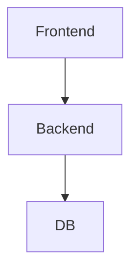

# Architecture Options
## 1. Evaluación previa
Proyecto SMALL.
## 2. Arquitecturas
### ARCH-OPT-001 Monolito Modular
- Complejidad: Baja.
- Justificación: Simplicidad.
- Diagrama:

- Explicación: Arquitectura clásica 3-tier.
- Ventajas: Simple.
- Inconvenientes: Escalado limitado.
- Riesgos: Ninguno relevante.
- Coste: Bajo.
- Adecuación: Alta.
## 3. Pila tecnológica
- Backend: Python/FastAPI.
- Frontend: React.
- DB: PostgreSQL.
- Infra: Docker.
- Justificación: Simplicidad.
## 4. Recomendación
Usar monolito modular.
