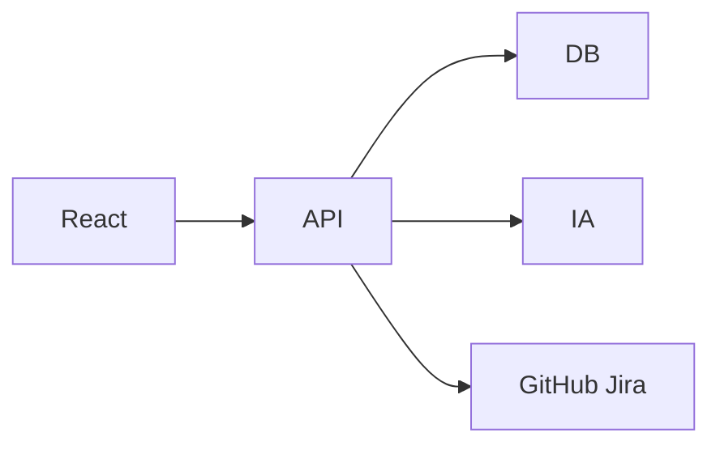

# Evaluación previa
Tamaño SMALL/MEDIUM, integraciones externas moderadas, baja necesidad de procesamiento masivo.

# ARCH-OPT-001 Monolito Clean Architecture
Backend FastAPI, Frontend React, PostgreSQL, Docker.
Ventajas: rapidez, bajo coste, mantenible.
Riesgos: crecimiento futuro requiere modularización.
Coste relativo: Bajo.

# ARCH-OPT-002 Monolito Spring Boot
Más robusto enterprise, mayor coste inicial.

# ARCH-OPT-003 .NET Web API
Buen encaje corporativo Microsoft.

# Riesgos de sobredimensionamiento
Microservicios generarían coste innecesario.

# Recomendación final
ARCH-OPT-001 por velocidad y simplicidad.