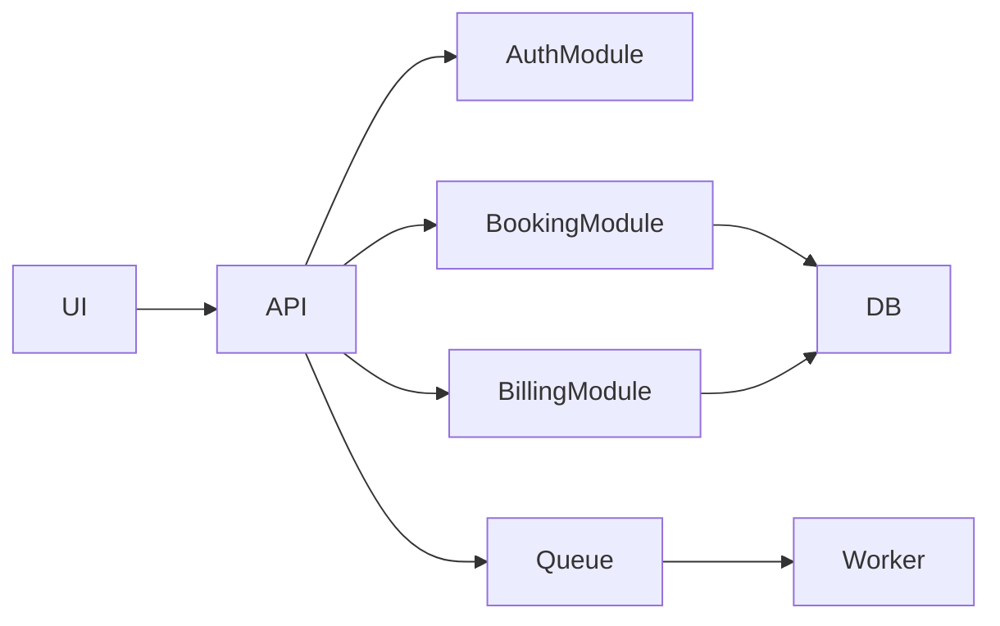
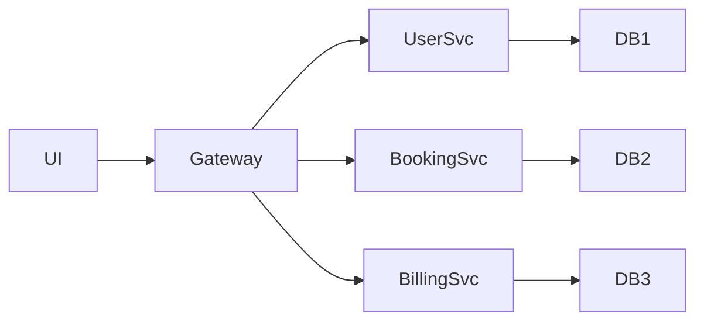
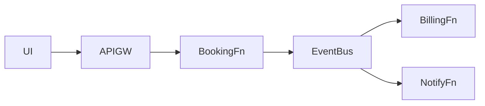

# 📦 AI Project Artifacts Definition Spec (ADS v2.2 - Architecture Options Assessment)

Este documento define el sistema de artefactos para transformar requisitos funcionales y no funcionales en entregables estructurados de análisis, arquitectura, backlog y documentación.

Su objetivo es que una IA pueda generar automáticamente:

* Backlog estructurado en Jira
* Documentación técnica en GitHub
* Modelo inicial de producto
* Varias opciones arquitectónicas comparadas
* Riesgos y dependencias
* Roadmap inicial
* Base objetiva para decisión posterior

---

# 🧠 0. PRINCIPIO FUNDAMENTAL

La IA **no debe saltar directamente a una solución**.

Antes de generar artefactos debe comprender el problema y razonar múltiples alternativas.

## Capas obligatorias previas

1. Comprender negocio
2. Detectar actores
3. Entender objetivos reales
4. Identificar restricciones
5. Detectar incertidumbres
6. Modelar dominio
7. Evaluar opciones técnicas
8. Diseñar backlog inicial
9. Analizar riesgos
10. Preparar trazabilidad

---

# 1. 🧭 TIPOS DE PROYECTO

## 🟢 SMALL

* 1 dominio funcional
* Equipo pequeño
* Baja complejidad
* Sin integraciones críticas
* Prioridad velocidad

**Opciones arquitectura mínimas:** 1

---

## 🟡 MEDIUM

* Varios módulos
* Integraciones externas
* Complejidad moderada
* 1–3 equipos
* Evolución futura esperada

**Opciones arquitectura mínimas:** 2

---

## 🔴 COMPLEX

* Multi-dominio
* Multi-equipo
* Alta criticidad
* Alta carga
* Compliance relevante
* Evolución larga

**Opciones arquitectura mínimas:** 3

---

# 2. 📊 MATRIZ DE ARTEFACTOS

| Artefacto       | SMALL | MEDIUM | COMPLEX | Destino       |
| --------------- | ----- | ------ | ------- | ------------- |
| OVR             | OBL   | OBL    | OBL     | GitHub        |
| REQMAP          | OPT   | OBL    | OBL     | GitHub        |
| EPIC            | OBL   | OBL    | OBL     | Jira          |
| STORY           | OBL   | OBL    | OBL     | Jira          |
| TASK            | OPT   | OBL    | OBL     | Jira          |
| SPIKE           | OPT   | OBL    | OBL     | Jira          |
| FLOW            | OBL   | OBL    | OBL     | GitHub        |
| ARCH-OPTIONS    | OBL   | OBL    | OBL     | GitHub        |
| ARCH-ASSESSMENT | OBL   | OBL    | OBL     | GitHub        |
| ARCH-L1         | OPT   | OBL    | OBL     | GitHub        |
| ARCH-L2         | —     | OPT    | OBL     | GitHub        |
| DATA            | OPT   | OBL    | OBL     | GitHub        |
| API             | OPT   | OBL    | OBL     | GitHub        |
| SEC             | —     | OPT    | OBL     | GitHub        |
| DEP             | —     | OPT    | OBL     | GitHub        |
| ADR             | —     | OPT    | OBL     | GitHub        |
| OPS             | —     | OPT    | OBL     | GitHub        |
| NFR             | OPT   | OBL    | OBL     | GitHub        |
| RISK            | OPT   | OPT    | OBL     | GitHub / Jira |
| TEST            | OPT   | OBL    | OBL     | GitHub / Jira |
| MILE            | —     | OPT    | OBL     | Jira          |
| ENAB            | —     | OPT    | OBL     | Jira          |
| OPENQ           | OBL   | OBL    | OBL     | GitHub        |

Leyenda:

* OBL = Obligatorio
* OPT = Opcional

---

# 3. 🧠 CAPAS DE RAZONAMIENTO OBLIGATORIAS

## 3.1 Business Understanding

Analizar:

* objetivos
* usuarios
* pain points
* valor económico
* métricas

Genera:

* OVR

---

## 3.2 Domain Modeling

Analizar:

* entidades
* ownership
* reglas
* lifecycle

Genera:

* DATA
* API

---

## 3.3 Process Reasoning

Analizar:

* procesos
* excepciones
* aprobaciones
* estados

Genera:

* FLOW
* STORY

---

## 3.4 Capability Modeling

Analizar:

* capacidades del sistema
* módulos funcionales

Genera:

* EPIC

---

## 3.5 Delivery Decomposition

Analizar:

* slices verticales
* entregables incrementales
* secuencia realista

Genera:

* STORY
* TASK
* ENAB
* MILE

---

## 3.6 Architecture Assessment

Analizar:

* opciones viables
* tradeoffs
* costes
* riesgos
* complejidad

Genera:

* ARCH-OPTIONS
* ARCH-ASSESSMENT

---

## 3.7 NFR Reasoning

Analizar:

* rendimiento
* disponibilidad
* seguridad
* recuperación
* escalabilidad

Genera:

* NFR

---

## 3.8 Governance Reasoning

Analizar:

* decisiones relevantes
* dependencias
* riesgos

Genera:

* ADR
* DEP
* RISK

---

# 🏗️ 4. ARCHITECTURE OPTIONS ASSESSMENT

## Regla principal

❌ La IA no selecciona automáticamente una arquitectura final.

✅ La IA presenta varias alternativas razonables y comparadas.

La decisión final pertenece a una fase posterior de revisión técnica.

---

## 4.1 Número mínimo de opciones

| Tipo proyecto | Opciones mínimas |
| ------------- | ---------------- |
| SMALL         | 1                |
| MEDIUM        | 2                |
| COMPLEX       | 3                |

---

## 4.2 Tipologías sugeridas

* Monolito clásico
* Monolito modular
* Hexagonal modular
* Microservicios
* Event Driven
* Serverless
* SaaS composable
* Data platform

---

## 4.3 Contenido obligatorio por opción

Cada opción debe incluir:

* id
* nombre
* estilo
* descripción ejecutiva
* cuándo encaja
* componentes
* límites de dominio
* tecnologías sugeridas
* diagrama Mermaid L1
* ventajas
* inconvenientes
* riesgos
* coste build
* coste run
* complejidad operativa
* complejidad desarrollo
* escalabilidad
* mantenibilidad
* observabilidad
* seguridad
* velocidad de entrega
* madurez requerida del equipo
* cuándo elegirla
* cuándo descartarla

---

## 4.4 Ejemplo correcto de opción A1

### A1 Monolito Modular



### Ventajas

* time-to-market alto
* bajo coste inicial
* operación simple

### Inconvenientes

* despliegue único
* riesgo de acoplamiento
* escalado parcial limitado

### Cuándo elegirla

* equipo pequeño
* salida rápida
* dominio aún cambiante

### Cuándo descartarla

* múltiples equipos autónomos
* alta escala independiente por dominios

---

## 4.5 Ejemplo correcto de opción A2

### A2 Microservicios



### Ventajas

* despliegues independientes
* ownership por equipos
* escalado por dominio

### Inconvenientes

* complejidad alta
* observabilidad avanzada requerida
* más coste operativo

### Cuándo elegirla

* varios equipos
* dominios claros
* crecimiento fuerte esperado

### Cuándo descartarla

* equipo pequeño
* presión fuerte de plazo corto

---

## 4.6 Ejemplo correcto de opción A3

### A3 Event Driven Serverless



### Ventajas

* elasticidad alta
* pago por uso
* integración rápida

### Inconvenientes

* lock-in cloud
* debugging complejo
* límites runtime

### Cuándo elegirla

* demanda variable
* fuerte uso cloud nativo

### Cuándo descartarla

* requisitos on-premise
* equipo sin experiencia cloud

---

## 4.7 ARCH-ASSESSMENT

Debe incluir:

* tabla comparativa
* scoring por criterio
* shortlist recomendada
* riesgos críticos
* gaps del equipo
* preguntas abiertas
* estado de decisión pendiente

---

## 4.8 Ejemplo de scoring

| Opción | Time to Market | Coste | Escala | Operación | Score |
| ------ | -------------- | ----- | ------ | --------- | ----- |
| A1     | 5              | 5     | 3      | 5         | 18    |
| A2     | 2              | 2     | 5      | 2         | 11    |
| A3     | 4              | 4     | 4      | 3         | 15    |

---

## 4.9 Estado obligatorio

```text
decision_status = PENDING_ARCH_REVIEW
```

---

# 📚 5. DEFINICIÓN DE ARTEFACTOS

## OVR

Resumen ejecutivo:

* problema
* oportunidad
* alcance
* exclusiones
* KPIs

---

## REQMAP

Trazabilidad requisito → artefactos.

---

## EPIC

Capacidad completa de negocio.

---

## STORY

Formato:

Como usuario quiero X para Y.

Debe ser:

* testeable
* valiosa
* observable

---

## TASK

Trabajo técnico ejecutable.

---

## SPIKE

Investigación con incertidumbre real.

---

## FLOW

Flujos Mermaid + narrativa.

---

## DATA

Entidades reales del dominio.

---

## API

Contratos y endpoints.

---

## SEC

* autenticación
* autorización
* permisos
* auditoría

---

## DEP

Dependencias externas/internas.

---

## ADR

Decisiones relevantes y tradeoffs.

---

## OPS

* despliegue
* observabilidad
* runbooks
* soporte

---

## NFR

Debe ser medible.

Ejemplos:

* p95 < 300 ms
* uptime 99.9%
* RTO < 1h
* RPO < 15m

---

## RISK

* impacto
* probabilidad
* mitigación

---

## TEST

* estrategia
* criterios aceptación
* cobertura

---

## MILE

Roadmap por fases.

---

## ENAB

Trabajo técnico habilitador.

---

## OPENQ

Preguntas abiertas reales.

---

# 🔗 6. TRAZABILIDAD OBLIGATORIA

Cada artefacto debe responder:

1. Qué requisito cubre
2. Qué valor aporta
3. Qué dependencia tiene
4. Qué riesgo reduce
5. Qué impacto tiene si cambia

---

# 📐 7. VALIDACIÓN DE CALIDAD

El resultado debe validar:

* backlog coherente
* historias útiles
* arquitectura profunda
* múltiples opciones reales
* Mermaid por opción
* tradeoffs claros
* NFR realistas
* riesgos concretos
* sin decisiones prematuras

---

# 🚀 8. FASES DEL SISTEMA

## Fase 1 Discovery

* requisitos
* análisis
* backlog inicial
* opciones arquitectura

## Fase 2 Architecture Review

* benchmark
* PoC
* costes reales
* skills equipo
* decisión formal

## Fase 3 Delivery

* Jira final
* GitHub final
* roadmap ejecución

---

# 🧪 9. PRUEBA OBLIGATORIA

## Prompt de prueba

Plataforma SaaS B2B de reservas corporativas:

* multi tenant
* 5000 clientes
* Google Workspace
* Microsoft 365
* pagos suscripción
* web + móvil
* SLA 99.9%
* equipo 6 personas
* salida en 4 meses

---

## Resultado esperado

Debe devolver:

* A1 Monolito modular
* A2 Microservicios
* A3 Event Driven / Serverless

Cada una con:

* Mermaid
* ventajas
* inconvenientes
* scoring
* shortlist

Si devuelve una sola opción o texto pobre, NO cumple ADS v2.2.

---

# 🎯 10. OBJETIVO DEL SISTEMA

Generar automáticamente:

* análisis funcional sólido
* backlog Jira útil
* documentación GitHub real
* alternativas técnicas profundas
* base para decisión posterior
* arquitectura evolutiva

---

# 🚨 11. REGLA FINAL

La IA no decide arquitectura final en discovery.

La IA propone, compara, puntúa y prepara una decisión informada posterior.
