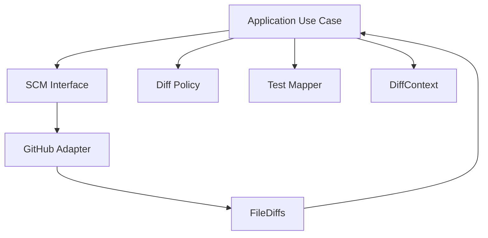

app/
├── domain/
│   ├── models/
│   │   └── diff_models.py
│   ├── interfaces/
│   │   └── scm_interface.py
│   └── services/
│       └── diff_policy.py
│
├── application/
│   └── use_cases/
│       └── build_diff_context.py
│
└── infrastructure/
    └── scm/
        └── github_scm_client.py

