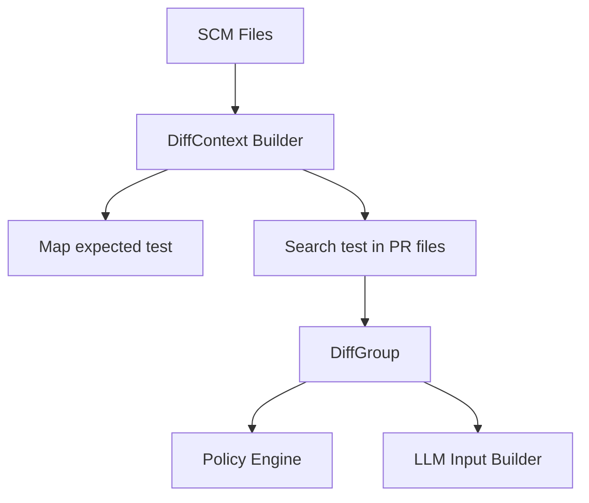

app/
├── domain/
│   ├── models/
│   │   └── policy_models.py
│   │
│   ├── services/
│   │   ├── policy_engine.py
│   │   └── rules/
│   │       ├── base_rule.py
│   │       ├── test_rule.py
│   │       └── naming_rule.py
│
├── application/
│   └── use_cases/
│       └── evaluate_policy.py
│
└── config/
    └── settings.py   (ya existente)

