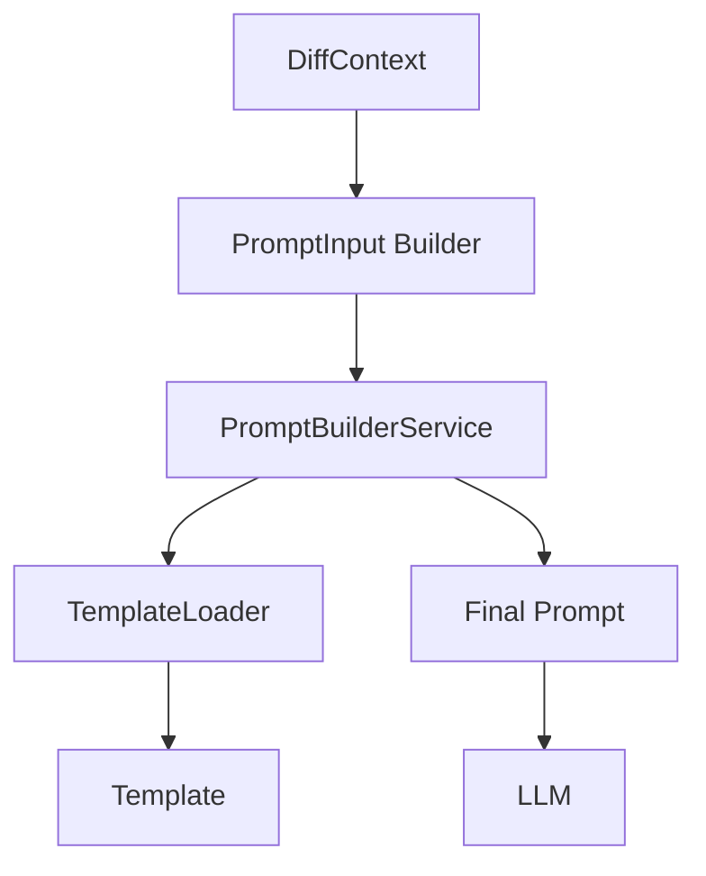

app/
├── domain/
│   ├── interfaces/
│   │   └── prompt_builder_interface.py
│   │
│   └── models/
│       └── prompt_models.py
│
├── application/
│   └── services/
│       └── prompt_builder_service.py
│
├── infrastructure/
│   └── prompts/
│       ├── python/
│       │   ├── default.txt
│       │   └── team_a.txt
│       │
│       └── java/
│           └── default.txt

