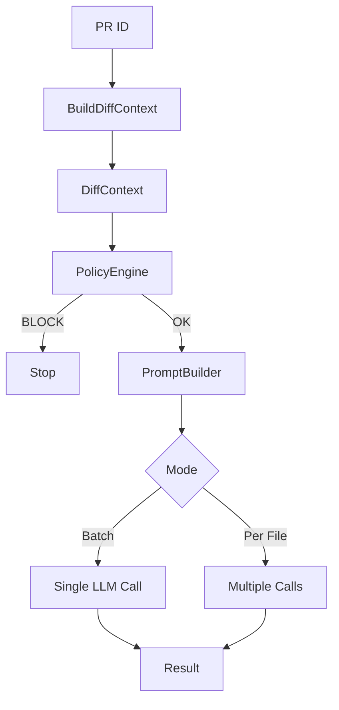

app/
├── domain/
│   ├── interfaces/
│   │   └── llm_interface.py
│   └── models/
│       └── review_models.py
│
├── application/
│   └── use_cases/
│       └── review_pull_request.py
│
└── infrastructure/
    └── llm/
        └── ollama_client.py   (ya lo tienes, lo alineamos)

