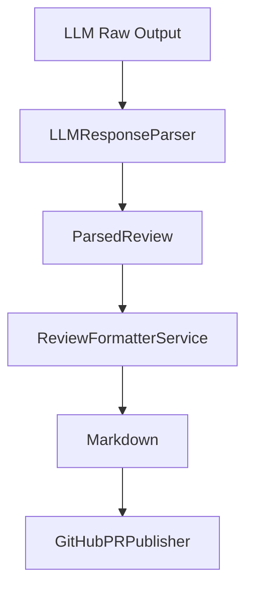

app/
├── domain/
│   ├── interfaces/
│   │   ├── parser_interface.py
│   │   └── publisher_interface.py
│   │
│   └── models/
│       └── review_issue_models.py
│
├── application/
│   └── services/
│       ├── review_parser_service.py
│       └── review_formatter_service.py
│
└── infrastructure/
    ├── parser/
    │   └── llm_response_parser.py
    │
    └── github/
        └── github_pr_publisher.py

