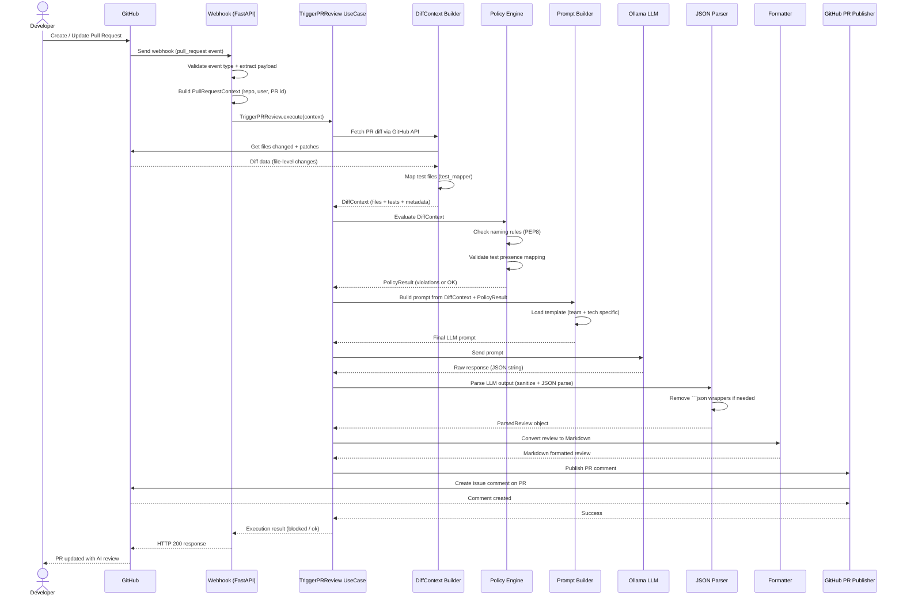

```mermaid
sequenceDiagram

actor Dev as Developer
participant GH as GitHub
participant WH as Webhook (FastAPI)
participant TC as TriggerPRReview UseCase
participant DC as DiffContext Builder
participant PE as Policy Engine
participant PB as Prompt Builder
participant LLM as Ollama LLM
participant JP as JSON Parser
participant FM as Formatter
participant PUB as GitHub PR Publisher

%% ==========================================
%% 1. DEVELOPER OPENS PR
%% ==========================================

Dev->>GH: Create / Update Pull Request

GH->>WH: Send webhook (pull_request event)

%% ==========================================
%% 2. WEBHOOK ENTRYPOINT
%% ==========================================

WH->>WH: Validate event type + extract payload
WH->>WH: Build PullRequestContext (repo, user, PR id)

WH->>TC: TriggerPRReview.execute(context)

%% ==========================================
%% 3. DIFF BUILDING
%% ==========================================

TC->>DC: Fetch PR diff via GitHub API
DC->>GH: Get files changed + patches
GH-->>DC: Diff data (file-level changes)

DC->>DC: Map test files (test_mapper)
DC-->>TC: DiffContext (files + tests + metadata)

%% ==========================================
%% 4. POLICY ENGINE
%% ==========================================

TC->>PE: Evaluate DiffContext

PE->>PE: Check naming rules (PEP8)
PE->>PE: Validate test presence mapping
PE-->>TC: PolicyResult (violations or OK)

%% ==========================================
%% 5. PROMPT BUILDING
%% ==========================================

TC->>PB: Build prompt from DiffContext + PolicyResult

PB->>PB: Load template (team + tech specific)
PB-->>TC: Final LLM prompt

%% ==========================================
%% 6. LLM EXECUTION (OLLAMA)
%% ==========================================

TC->>LLM: Send prompt

LLM-->>TC: Raw response (JSON string)

%% ==========================================
%% 7. PARSING & NORMALIZATION
%% ==========================================

TC->>JP: Parse LLM output (sanitize + JSON parse)

JP->>JP: Remove ```json wrappers if needed
JP-->>TC: ParsedReview object

%% ==========================================
%% 8. FORMATTING
%% ==========================================

TC->>FM: Convert review to Markdown

FM-->>TC: Markdown formatted review

%% ==========================================
%% 9. PUBLISH TO GITHUB
%% ==========================================

TC->>PUB: Publish PR comment

PUB->>GH: Create issue comment on PR
GH-->>PUB: Comment created

PUB-->>TC: Success

%% ==========================================
%% 10. END FLOW
%% ==========================================

TC-->>WH: Execution result (blocked / ok)
WH-->>GH: HTTP 200 response
GH-->>Dev: PR updated with AI review

```